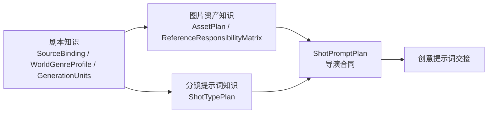

# PRD｜AI 短剧素材中心：统一文件树与导演知识库可视化

> 2026-08-28 调整说明：本 PRD 的“统一文件树与素材预览”部分继续有效；原“结构化知识索引、来源 API、成熟度与 `knowledgeUsed` 追踪”方案已被后续用户决定取代，仅作为历史设计保留。当前知识库事实源是 `director-knowledge-base/` 下的剧本、图片素材、分镜提示词三组 Markdown，AI Director 按问题渐进读取和维护，网页只负责让用户看懂这些文档，不再建设知识接口或登记系统。

- 状态：`DRAFT_FOR_CONFIRMATION`
- 日期：2026-08-28
- 范围：项目素材浏览、导演知识库可视化、来源资料与剧本样本目录、AI 知识使用契约
- 不授权：修改、复制或迁移真实素材，网页内编辑知识，调用 AI，生成媒体，写入 LibTV，提交或发布

## Problem Statement

当前产品已经能安全地浏览每部短剧的本地素材，支持图片、文本、音频和视频预览，URL 也能保留目录、文件、搜索和显示状态。但它仍然是一个“目录栏 + 文件栏 + 预览栏”的素材浏览器，尚未成为能解释 AI 短剧生产逻辑的创作工作台。

当前问题包括：

1. 左侧只有目录，中间才出现文件。同一套层级被拆成“先找目录、再找文件”两步，用户不能像使用 VS Code 一样在一棵树里理解真实结构。
2. “分集台”主要依赖路径和文件名推断集数与生产阶段，没有成为真实生产事实源，反而增加了模式切换、筛选和 URL 状态。
3. 点击文件夹后，系统会自动选中第一个文件。文件夹本身不能作为一个可查看对象，用户无法快速浏览它下面的全部素材。
4. 当前缩略图视图对图片和视频有效，但文本只有文件图标、音频只能进入右侧预览后试听，不能承担快速盘点职责。
5. 项目剧本、图片、音频和视频位于每部短剧的本地工作区；导演知识库位于仓库级知识目录。当前 Web 只扫描前者，用户无法在网页里查看标准、知识卡、案例、证据和成熟度。
6. 如果只是把知识库当成另一棵普通文件目录展示，用户仍然看不出 AI 为什么使用某条知识、它影响 AssetPlan 还是 ShotPromptPlan、什么时候必须停止。
7. 当前知识库已有 3 份 ACTIVE 标准、14 张知识卡和 7 个案例，但没有 narrative 领域知识卡，也没有 VALIDATED 知识。产品必须公开这些证据缺口，不能用导航完整度伪装知识完整度。
8. 新增的《AI 漫剧全流程》学习文档和剧本市场快照都属于“来源资料”，不是已经验证的导演知识。课程文档主要记录作者主张、操作清单和示例；剧本快照主要记录登录后可见的市场资料与前 5 集试读。若把它们直接显示成标准或知识卡，AI 会把“别人这样说 / 市场这样展示”误判为“这样做已经被证明有效”。
9. 剧本市场快照已有 268 个归档条目，但只有 231 个包含前 5 集，另有 37 个只有资料；来源范围也没有给出改编、再发布或商用授权。产品既要让这些样本可检索、可研究，也必须阻止“已采集 = 已学习 = 可复用 = 可商用”的错误晋级。

用户真正需要的是两个彼此隔离、但能通过稳定 ID 互相解释的空间：

- **项目素材库**：管理某一部短剧的剧本文件、图片、音频、视频和生产资料。
- **导演知识库**：管理跨短剧复用的剧本方法、图片资产规范、分镜提示词规范，以及支撑它们的来源资料、研究案例和证据。

导演知识库内部再明确分成“知识地图”和“来源与研究”。前者回答“AI 已经可以依据什么工作”，后者回答“这些知识从哪里来、目前研究到哪一步”。“来源与研究”是证据支撑层，不是与剧本、图片资产、分镜提示词并列的第四个生产核心。

## Solution

### 1. 产品信息架构

产品顶部提供两个一级入口：

| 一级入口 | 内容边界 | 物理事实源 |
| --- | --- | --- |
| 项目素材 | 每部短剧的剧本、图片、音频、视频和生产文档 | 当前项目的本地 `library` |
| 导演知识库 | 跨项目复用的标准、知识卡、风险、案例、证据和验证记录；以及只读的来源目录和研究队列 | 仓库级导演知识目录 + 本地工作区中被显式登记的来源档案 |

用户心智仍只有“项目素材 / 导演知识库”两个一级空间，但服务端实际隔离三个安全根：项目 `library`、Git 管理的规范化知识目录、本地工作区中 Git 忽略的原始来源档案。三者使用不同的数据类型和路由；网页不能接受任意本机路径。项目剧本不得复制进导演知识，原始来源不得通过符号链接伪装成项目素材或正式知识。

导演知识库以三个生产核心作为唯一一级业务分类：

1. **剧本知识**：怎样绑定剧本版本、理解世界观与类型、抽取可见事实、拆 scene/beat、识别因果、反转、情绪和连续性。
2. **图片资产知识**：人物、场景、道具、状态、关键帧和逐镜参考职责应该怎样规划、生成和验收。
3. **分镜提示词知识**：怎样选择镜头类型、拆 generation unit、组织表演、机位、运镜、轴线、时间、声音和参考映射。

“标准 / 知识卡 / 风险 / 案例 / 证据 / 验证记录”是三个核心共有的知识层级，不作为与三大核心并列的第四条生产线。工作流知识是跨域闸门，也不单独抢占一级入口。

课程资料中涉及的选题、Brief、预演、后期、发布和商业复盘使用 `productionStage[]` 作为横切标签展示覆盖范围，不在本期新增“后期知识”或“商业知识”一级入口。

### 2. AI 实际使用链路

#### 2.1 知识形成链

禁止 `来源目录条目 → 知识卡` 的直接晋级。读取一篇课程文档或归档一部剧本，只能证明来源存在；只有完成选样、结构化研究、证据登记和适用边界判断后，才允许形成 DRAFT 知识候选。知识成熟度继续按跨案例复用和自有生产验收提升。

来源文件中的文字一律视为研究内容，不视为对 AI Director 的执行指令。当前项目剧本、用户明确决定和生产事实仍高于任何来源或知识卡。

#### 2.2 生产使用链

这不是简单的“剧本 → 图片 → 提示词”线性流水线。剧本同时决定需要被看见的资产事实和镜头主任务；AssetPlan 与 ShotTypePlan 在 ShotPromptPlan 汇合。图片资产缺失、职责冲突、镜头类型不明确或节点时长未知时，系统必须显示阻塞，不能继续伪装成 prompt-ready。

### 3. 项目素材库：统一文件树

#### 3.1 删除分集台

- 删除“目录 / 分集台”切换、分集汇总卡和分集阶段筛选。
- 保留从文件名解析出的 EP、镜头、版本和状态提示，作为文件标签和搜索信息，不再把它们当成独立浏览模式。
- 旧的 `mode=episode`、`episode`、`stage` 和 `scope=episode` 链接不得报错。首次打开时应无损归一到对应文件所在目录；找不到具体文件时回到项目根目录，并用 replace 方式清理旧参数。

#### 3.2 VS Code 风格文件树

- 左栏同时展示文件夹和文件；同级默认“文件夹在前、文件在后”，使用自然排序。
- 展开箭头只负责展开或收起；点击文件夹名称负责选中文件夹；点击文件负责选中文件并打开预览。
- 方向键、Home、End、左右展开收起、Enter/Space 选择必须可用。
- 当前文件、当前文件夹、展开状态使用不同视觉反馈。选中的文件夹和文件继续由 URL 表达；纯展开状态保存在本机，不污染可分享链接。
- 文件树只展示实际目录和文件，不凭 EP、状态或命名规则创建虚拟节点。

#### 3.3 文件夹是可查看对象

- 点击文件夹后，中间主区域进入“文件夹概览”，默认以缩略图网格展示该文件夹下的全部后代文件。
- 不自动选中第一个文件；右侧默认由当前文件夹概览铺满。从内容区点击文件时保留文件夹上下文并打开通用预览弹窗；只有从左侧文件树点击文件时，右侧才切换为铺满的独立文件预览。
- 每张卡展示相对当前文件夹的来源路径，避免递归展示时失去层级感。
- 保留搜索、正文搜索、排序、项目范围和列表/网格切换；文件夹视图默认网格，用户仍可显式切换为紧凑列表。
- 大目录使用懒加载媒体和渐进渲染；不得在打开目录时预加载全部音频或解码全部视频。

#### 3.4 各类型卡片

| 类型 | 文件夹概览中的表现 | 点击后的表现 |
| --- | --- | --- |
| 图片 | 在统一卡片画布中按真实宽高比完整显示，不裁切或拉伸；首次加载媒体时从实际像素读取并显示 `9:16`、`16:9` 等比例标签，同时展示名称、路径和现有生产标签 | 内容区点击打开原图弹窗；文件树点击切换为右侧独立原图预览 |
| 文本 / Markdown | 标题、第一段有效正文摘要、名称和路径 | 内容区点击打开 Markdown 弹窗；文件树点击切换为右侧独立阅读器 |
| 音频 | 文件名、轻量音频标识、按需播放按钮；播放前只加载 metadata | 内容区点击打开播放器弹窗；文件树点击切换为右侧独立播放器 |
| 视频 | poster 或首帧缩略图、时长可用时显示时长 | 内容区点击打开审片弹窗；文件树点击切换为右侧独立审片播放器 |
| 其他 | 类型图标、名称、大小和路径 | 内容区点击弹窗明确提示需在 Finder 查看；文件树点击使用右侧独立提示页 |

音频卡的播放按钮不得触发整张卡的文件切换；同一时间默认只播放一个音频。文本摘要需要去除 Markdown 控制字符并限制长度，空文档明确显示“无可用摘要”，不能把文件名伪装成正文摘要。

### 4. 导演知识库：三大核心可视化

#### 4.1 独立入口和路由

- 新增全局导演知识库入口，不归属于任何单部短剧，也不出现在项目素材树中。
- 知识库首页首先展示“剧本知识 / 图片资产知识 / 分镜提示词知识”三张业务卡，以及它们在生产链中的输入、输出、当前标准数、知识卡数和证据缺口。
- 每个知识条目使用稳定 ID 作为深链标识；刷新、前进后退和分享链接必须保持当前领域、条目、筛选和搜索。

#### 4.2 知识与来源资料分栏

- 导演知识库默认打开“知识地图”，展示剧本知识、图片资产知识和分镜提示词知识三张核心卡。
- 二级入口“来源与研究”按“剧本样本 / 课程与方法资料 / 成片与生产画布案例”分类。它不与三大核心抢占同一层级。
- “剧本样本”当前展示为只读 Catalog，而不是把 268 个目录挂进普通文件树。列表先展示平台、标题、可见集数、资料完整度、来源时间、权利状态和研究状态；打开详情后再按需读取整理稿。
- 每条来源必须分别显示 `UNSTUDIED / SELECTED / SOURCE_STUDIED / MEDIA_STUDIED` 等研究状态，以及独立的知识成熟度关系。`SOURCE_STUDIED` 不等于知识卡的 `OBSERVED`，`MEDIA_STUDIED` 也不等于人工接受。
- 当前《AI 漫剧全流程》文档登记为课程来源。其“前 15 秒”“2-3 秒原子动作”“先试 3 个镜头”等内容先标记为 `CREATOR_CLAIM` 或 `DOCUMENTED_PROCEDURE`；未取得原始生产链、前后对照和自有试片验收前，不升级为有效性标准。
- 当前剧本市场快照保持原地、只读、不可变，不复制进 Git 知识目录。位于 Downloads 的课程文档不应成为长期运行依赖；进入实现阶段后应在另行确认复制范围后，以“复制、校验哈希、保留原文件”的方式导入项目本地来源档案。
- 课程 Markdown 引用了同目录关键帧图片和本地 720P 视频，不能只复制一个 Markdown 后留下断链。当前建议默认完整复制约 279 MB 的来源包到 Git 忽略的项目工作区；若用户选择轻量导入，则只复制 Markdown 与约 1.4 MB 的图片目录，并显式标记 `MEDIA_NOT_IMPORTED`，不能称为完整离线来源。

剧本样本的三类文件职责固定为：

| 文件 | 产品职责 | AI 默认读取策略 |
| --- | --- | --- |
| `source.json` | 来源、时间、可见范围和可用字段 | Catalog 首次加载 |
| `剧本资料.md` | 按大纲、世界观、人物、分集整理的可读派生稿 | 命中样本后按章节加载 |
| `原始页面文本.txt` | 页面可见文本证据与异常复核 | 整理稿存疑时才回退，不进入默认全文索引 |

#### 4.3 知识条目层级

每个核心领域内部按以下层级组织：

1. **当前标准**：项目当前要求怎样做，显示版本和 `policyStatus`。
2. **可复用机制**：pattern 卡，显示 `OBSERVED / REUSABLE / VALIDATED`。
3. **风险与停止条件**：risk 卡，明确何时不能继续。
4. **案例与证据**：展示来源案例、证据条目、读取日期、模型/画幅/时长等条件。
5. **实践验证**：展示自有生产使用、真实播放/试听和人工接受记录。
6. **已知缺口**：没有卡片、没有竖屏证据、没有自有接受或存在相互冲突时明确展示。

当前 narrative 知识卡为 0，因此“剧本知识”首页应显示待建设状态。现有跨域工作流标准不能伪装成已经成熟的剧本知识。后续应通过专门案例研究建立剧本标准和卡片；不能把“3 秒钩子、15 秒反转”等经验数字硬编码成产品真理。

#### 4.4 AI 使用契约

每份标准或知识卡的详情页必须直接回答以下问题：

- **什么时候会用**：触发特征、适用条件和用户问题。
- **什么时候不用**：排除条件、冲突和失效条件。
- **读取什么**：需要的剧本事实、资产状态、镜头类型、模型、画幅或时长信息。
- **影响什么**：`WorldGenreProfile`、`AssetPlan`、`ReferenceResponsibilityMatrix`、`ShotTypePlan` 或 `ShotPromptPlan` 中的具体输出部分。
- **如何阻塞**：缺失、冲突、`UNKNOWN`、代表试片要求和停止条件。
- **为什么可信**：标准状态、证据成熟度、局部 `evidenceOverrides`、来源案例和实践记录。
- **怎样验收**：图片实际查看、视频实际播放、声音试听、人工接受分别展示，不合并成一个“通过”。

产品不得只展示知识正文。用户必须能从一条规则追到它影响的生产产物，也能从一个输出字段反查使用过的标准、知识卡和案例。

#### 4.5 三大核心的 AI 输出映射

| 核心知识 | AI 检索输入 | AI 产物 | 主要阻塞条件 |
| --- | --- | --- | --- |
| 剧本知识 | 精确剧本版本、范围、世界规则、人物/场景/状态、用户决定 | SourceBinding、事实/决定/未知账本、WorldGenreProfile、generation units | canon 不明、事实冲突、关键创作分支未选择 |
| 图片资产知识 | 可见实体、状态、关系、场景、道具、已有资产、媒体预算 | AssetPlan、逐镜参考职责、缺失与冲突、图片验收标准 | 具名人物母版缺失、引用职责错位、只有污染母版、预算冲突 |
| 分镜提示词知识 | generation unit、观众效果、AssetPlan、时长、画幅、模型、对白声音 | primary shot type、ShotTypePlan、ShotPromptPlan、fallback split | 主任务不明、时长不匹配、节点时长未知、复杂机制未拆分 |

ShotPromptPlan 仍是导演合同，不是最终创意提示词。最终 prose 的作者和后续执行工具必须单独显示，避免把“会使用知识”误解为“自动生成并执行”。

### 5. 知识元数据与服务边界

- 项目素材与导演知识使用不同的数据模型。文本素材不能因为是 Markdown 就被识别成知识卡；知识卡也不能被识别成项目剧本。
- 知识目录中的机器索引是知识元数据事实源，Markdown 是人类可读正文。网页不得仅靠文件名猜测领域、成熟度或关系。
- 在现有证据 `domain` 之外增加业务字段 `knowledgeArea`，值限定为 `script`、`image-asset`、`shot-prompt`。跨域工作流使用多个 `knowledgeArea`，而不是新增第四个业务入口。
- 来源目录使用独立的 `SourceRecord`，至少包含稳定 `sourceId`、来源类型、平台/作者、来源 URL、采集或整理时间、相对文件引用及哈希、可用范围、完整度、权利状态、研究状态、检查深度、时效性和关联案例/知识卡。来源状态不得复用知识成熟度字段。
- 证据条目增加 `claimType`，至少区分 `CREATOR_CLAIM`、`DOCUMENTED_PROCEDURE`、`ILLUSTRATIVE_EXAMPLE`、`OBSERVED_ARTIFACT`、`OBSERVED_RESULT` 和 `HUMAN_ACCEPTED_RESULT`，避免把“来源声称有效”显示成“已观察到有效”。
- 标准、知识卡、案例和验证记录继续使用稳定 ID 关联。至少支持 `sourceCardIds`、`sourceCaseIds`、`evidenceRefs`、`derived-from`、`supersedes` 和 `usedBy` 等可追溯关系。
- 知识服务只读、固定根目录、拒绝路径穿越与越界符号链接，不向前端返回本机绝对路径。
- 来源服务只读取登记表中的工作区相对路径。现有剧本快照 `index.json` 含本机绝对 `targetDir`，只能作为导入种子；服务端必须生成统一的相对路径视图，不能把原字段透传给前端。
- 来源中的带签名远程 URL 必须在展示、日志和派生索引中去掉查询参数。`logged-in-visible-preview` 只表示当时可见；当前快照默认 `RIGHTS_UNKNOWN + RIGHTS_REVIEW_REQUIRED`，不得据此生成改编稿、公开全文或执行商用生产。
- AI 检索剧本样本时先查结构化 Catalog，再按题材、语言、完整度、生产限制和研究状态选择少量代表样本，最后按需加载命中的 Markdown 章节。结果必须携带 `sourceId + snapshotId + 相对路径 + 文件哈希 + 章节定位 + 权利状态`，不能一次把全部原始页面文本塞入上下文。
- 知识索引校验失败时，页面显示明确错误和失败范围，不回退成无语义的普通文件扫描。

### 6. 分期交付

#### M0｜来源治理与 Catalog 合同

- 冻结“原始来源 / 来源目录 / 已研究案例 / 证据 / 知识卡”的边界和晋级规则。
- 为课程资料、剧本样本和成片画布案例建立统一 `SourceRecord` 与权利闸门。
- 为当前两个剧本平台建立只读适配层，消除字段差异和绝对路径；原始快照保持不变。
- 明确课程来源包的项目内导入位置、完整/轻量复制选项、哈希校验流程和原文件保留策略，本阶段不实际复制。

#### M1｜统一文件树

- 删除分集台及相关 UI 状态。
- 左侧改为文件夹与文件统一树。
- 文件夹点击进入缩略图概览。
- 补齐文本摘要和音频卡内按需播放。
- 保持项目边界、深链、搜索、预览、暗色主题和 PC 桌面端可用；移动端专项适配延后。

#### M2｜导演知识库与来源库只读可视化

- 新增知识库独立路由与安全只读服务。
- 上线三大核心首页、标准/卡片/风险/案例/验证层级和详情页。
- 上线“来源与研究”入口、剧本样本 Catalog、课程来源详情和研究队列；原始 TXT 默认折叠。
- 展示 `CAPTURED_5 / METADATA_ONLY / UNAVAILABLE`、完整性、权利闸门和研究状态，不把市场评分或推荐当成效果证据。
- 展示 policyStatus、evidenceStatus、evidenceOverrides、来源和证据缺口。
- 增加 `knowledgeArea` 映射并更新知识校验。

#### M3｜AI 使用追溯

- 在知识详情中展示触发条件、读取输入、影响产物和停止条件。
- 支持从 `ScriptProductionAnalysis v1` 的 `knowledgeUsed` 反向打开知识条目。
- 支持查看“采用 / 因条件不符而拒绝 / 被项目事实覆盖”的知识使用清单。
- 本阶段仍不在网页内调用 AI；只展示可审计的分析产物和知识引用。

## User Stories

1. 作为短剧创作者，我希望在一棵文件树里同时看到文件夹和文件，从而不必在目录栏和文件栏之间反复确认层级。
2. 作为短剧创作者，我希望展开箭头只控制展开状态、文件夹名称只控制选中状态，从而避免一次点击产生两个不可预期动作。
3. 作为短剧创作者，我希望点击文件夹后看到它下面全部文件的缩略图概览，从而快速盘点整类素材。
4. 作为短剧创作者，我希望选中文件夹时系统不要擅自打开第一个文件，从而明确区分“查看文件夹”和“查看文件”。
5. 作为短剧创作者，我希望图片卡按真实宽高比完整显示并标明实际比例，从而一眼区分竖图、横图，并快速发现构图、版本或人物错误。
6. 作为短剧创作者，我希望文本卡显示真实正文摘要，从而不用逐个打开 Markdown 才知道内容。
7. 作为短剧创作者，我希望在音频卡上直接点击试听，从而快速比较角色音色候选。
8. 作为短剧创作者，我希望卡片内播放音频时不会意外切换文件，从而保持当前浏览上下文。
9. 作为短剧创作者，我希望从内容区点文件时使用弹窗快速查看，而从左侧文件树点文件时右侧切换为铺满的独立预览，从而按浏览意图选择轻量查看或专注阅读/审片。
10. 作为短剧创作者，我希望搜索、正文搜索、排序和当前文件夹/全项目范围继续可用，从而能处理数百个素材。
11. 作为短剧创作者，我希望刷新、前进、后退和复制 URL 后仍回到同一文件夹或文件，从而可以稳定分享本地工作位置。
12. 作为旧链接使用者，我希望历史分集台链接仍能安全落到有效目录或文件，而不是出现空白页或 404。
13. 移动端文件树与预览交互列入后续需求，不纳入本期开发与验收。
14. 作为键盘用户，我希望能用方向键、Home、End、Enter 和 Space 浏览树，从而无需依赖鼠标。
15. 作为知识库读者，我希望项目素材和导演知识有两个明确入口，从而不会把项目剧本误当成通用知识。
16. 作为知识库读者，我希望知识库首页只展示剧本知识、图片资产知识和分镜提示词知识三个核心，从而一眼理解生产底盘。
17. 作为知识库读者，我希望看到三大核心怎样汇合成 AssetPlan、ShotTypePlan 和 ShotPromptPlan，从而预判 AI 的工作顺序。
18. 作为知识库读者，我希望每个领域分别看到标准、机制、风险、案例、验证和缺口，从而区分规则与证据。
19. 作为知识库读者，我希望看到 ACTIVE 与 REUSABLE/VALIDATED 是两套不同状态，从而不会把项目策略误读成质量证明。
20. 作为知识库读者，我希望镜头子类型的 evidenceOverrides 紧贴对应类型显示，从而知道哪些规则仍需代表试片。
21. 作为知识库读者，我希望点击知识卡能看到来源案例和具体证据，从而判断它是不是从一个偶然样例推出来的。
22. 作为知识库读者，我希望看到案例的模型、画幅、时长和读取日期，从而判断经验是否适用于当前项目。
23. 作为知识库读者，我希望没有 narrative 卡或没有 VALIDATED 证据时页面公开显示缺口，从而不会被“分类齐全”误导。
24. 作为 AI 导演使用者，我希望每条知识都说明触发条件，从而知道什么剧本或镜头会命中它。
25. 作为 AI 导演使用者，我希望每条知识都说明排除条件，从而知道什么情况下 AI 不应该套用它。
26. 作为 AI 导演使用者，我希望每条知识都指出影响哪个输出字段，从而能检查它究竟改变了资产规划还是分镜合同。
27. 作为 AI 导演使用者，我希望缺失资产、冲突或未知节点时长能明确阻断 prompt-ready，从而避免完整但不可执行的假计划。
28. 作为 AI 导演使用者，我希望从分析结果反查所有使用过的标准、卡片和案例，从而审计 AI 是否真正使用了知识库。
29. 作为 AI 导演使用者，我希望看到哪些知识因条件不符被拒绝，从而避免“没显示就当没检索”的黑箱。
30. 作为导演，我希望 ShotPromptPlan 和最终创意提示词分栏显示，从而保持导演合同与创意 prose 的职责边界。
31. 作为知识维护者，我希望三大业务分类和证据 domain 分开建模，从而既符合用户心智又不破坏证据结构。
32. 作为知识维护者，我希望索引校验失败时页面明确报错，从而不会把损坏的知识静默展示为普通文本。
33. 作为知识维护者，我希望知识详情显示版本、更新时间、来源和替代关系，从而避免使用过时规则。
34. 作为知识维护者，我希望网页一期保持只读，从而继续通过版本化文件、校验器和人工审核维护知识。
35. 作为项目所有者，我希望任何 UI 升级都不移动、覆盖或删除现有素材，从而保持本地生产资料安全。
36. 作为项目所有者，我希望项目素材继续完全处于 Git 忽略边界、知识 Markdown 继续处于仓库版本控制，从而保持两类数据的治理差异。
37. 作为知识库读者，我希望“剧本知识”和“剧本样本”分开显示，从而知道前者是可复用方法、后者只是待研究来源。
38. 作为知识库读者，我希望看到 273 个市场条目中哪些已归档、哪些有前 5 集、哪些只有资料、哪些不可用，从而不把局部试读误当完整剧本。
39. 作为知识库读者，我希望课程中的作者主张、操作步骤、示例、观察结果和人工接受结果使用不同标签，从而判断一句话到底有多强的证据。
40. 作为知识维护者，我希望从来源条目创建的只是 DRAFT StudyCase，而不是自动生成知识卡，从而保留研究和晋级闸门。
41. 作为知识维护者，我希望每个来源保留相对路径、哈希、检查深度和关联知识，从而能复核知识血缘且不暴露本机目录。
42. 作为项目所有者，我希望登录可见的市场试读默认显示权利待审核，从而不会被系统误导为可以改编或商用。
43. 作为 AI 导演使用者，我希望 AI 先筛 Catalog、再读取少量命中章节，并返回精确来源定位，从而避免数百份文本污染判断。
44. 作为 AI 导演使用者，我希望来源内容永远不能覆盖当前项目剧本和用户决定，从而确保借鉴案例不会篡改当前故事事实。

## Implementation Decisions

- 保留现有“项目 → library”路由作为项目素材入口，新增独立的全局知识路由；两套路由不共享路径语义。
- 文件浏览模型由“目录数组 + 文件数组的分栏呈现”升级为统一 Explorer 节点模型，但服务端仍只读取实际文件系统，不创建虚拟分集目录。
- 选中文件夹时内容区域使用递归后代文件集合；树节点仍保持实际父子关系。递归卡片必须显示相对路径。
- 文件夹选中、文件选中和弹窗/独立预览方式都由 URL 表达；内容区弹窗使用 `preview=dialog`，没有该参数的文件深链使用右侧独立预览。展开状态属于本机 UI 偏好。旧分集参数只做兼容归一，不继续参与新页面状态。
- 文本摘要和音频播放是预览能力，不改变文件；文本读取设大小上限，音频只在用户点击时加载，避免目录打开即产生大量 IO。
- 项目素材 API 保持项目根、真实路径和符号链接边界校验；知识库另建固定只读根与独立 API，不允许前端传入任意根目录。
- 知识索引是结构化元数据事实源；Markdown 是正文事实源。Web 和 AI Director 校验器必须理解相同的 `knowledgeArea`、状态和关系定义。
- `knowledgeArea` 是面向用户和 AI 工作链路的业务分类；现有 evidence `domain` 继续用于证据检索。workflow 可关联多个业务分类，但不创建第四张顶层业务卡。
- “来源与研究”是支撑层，不是第四个 `knowledgeArea`。剧本市场内容在 UI 中命名为“剧本样本”，不能命名为“已学剧本”或“可复用剧本”。
- 当前剧本快照已位于正确的 Git 忽略工作区，保持只读、原地使用；不得为了 Web 展示移动进 `library` 或复制进 `director-knowledge-base`。
- 课程学习文档当前在 Downloads。实现时不得长期引用该绝对路径；导入采用复制、SHA-256 校验和保留源文件，并在项目工作区来源目录登记。实际复制不由本 PRD 自动授权。
- 根 `index.json` 只作为快照清单，平台字段差异由服务端适配器归一；前端和 AI 不直接依赖其中的本机绝对路径。
- 市场推荐、评分、商业标签和课程作者结论都属于来源声明，不是实际效果证据。只有生产产物、播放/试听检查和人工接受记录能提升相应证据层级。
- 后期、发布和商业信息本期仅作为 `productionStage[]` 横切来源标签和已知缺口，不扩展三大核心，也不进入当前 AI 导演的自动输出职责。
- “剧本知识”当前允许为空并显示待建设。现有工作流标准只作为跨域链路，不冒充已经有案例支持的剧本方法库。
- “3 秒钩子、15 秒反转”等数值只允许进入带适用条件和成熟度的知识卡，不成为固定 UI 校验规则。
- 每份可供 AI 检索的标准或知识卡补充使用契约元数据：trigger、exclusion、required inputs、output targets、stop conditions 和 acceptance。
- `knowledgeUsed` 必须记录采用、拒绝和被更高优先级事实覆盖的条目，并保留标准版本与卡片成熟度；不允许只输出一个无理由 ID 列表。
- 一期知识库只读；网页内新增、编辑、删除、晋级或写入验证记录另立需求，并要求可恢复、版本化和审计设计。
- 本 PRD 不在 Web 内集成 AI 运行时。AI 分析、媒体生成和外部写入继续由既有 Skill 与独立授权控制。
- 保留现有 Markdown 阅读、相对链接、Finder 打开、视频审片、音频波形、暗色主题和布局能力；删除分集台不得误删这些能力。
- 桌面采用“固定文件树 + 单一右侧工作区”两区布局；点击文件夹时右侧铺满文件夹概览，内容区文件点击使用弹窗，文件树文件点击才让右侧切换为铺满的文件预览，不常驻空预览栏。

## Testing Decisions

- 主要验收 seam 使用一套真实浏览器级场景：启动带临时项目素材根和临时知识根的本地服务，从用户路由验证文件树、文件夹概览、文件预览、知识检索和刷新/前进后退。测试只断言用户可观察行为，不断言 React 内部状态。
- 项目素材场景至少覆盖：嵌套目录、图片、Markdown、空文本、音频、视频、其他文件、中文路径、文件夹递归展示、无自动首文件选择、内容区弹窗预览与文件树独立预览。
- 图片缩略图场景至少覆盖：从媒体实际像素识别 `9:16` 与 `16:9`、非标准比例不伪装成标准比例，以及 `object-fit: contain` 下的无裁切完整显示。
- 文件树场景至少覆盖：鼠标展开/选择、键盘移动、文件点击、文件夹点击、选中态、展开态持久化和无虚拟分集节点。
- URL 场景至少覆盖：目录深链、文件深链、搜索与显示状态、刷新、浏览器前进后退，以及旧分集参数的兼容归一。
- 知识场景至少覆盖：三大核心入口、空的剧本知识领域、ACTIVE 与证据成熟度分开展示、OBSERVED override、案例证据跳转、验证缺口和使用契约字段。
- 来源场景至少覆盖：两个平台字段归一、273/268/5 快照统计、231 个前 5 集样本、37 个仅资料样本、806 条哈希状态、课程来源的检查深度、权利待审核和“来源不能直接晋级知识卡”。
- 来源安全测试至少覆盖：绝对 `targetDir` 不出现在 API、签名 URL 查询参数不出现在日志/索引、未登记路径不可读取、原始 TXT 默认不批量加载、路径穿越和越界符号链接被拒绝。
- AI 检索合同测试使用小型 fixture 验证“Catalog 过滤 → 章节按需读取 → 来源定位回传”，不得在自动化测试中读取或快照真实市场正文。
- 安全测试继续覆盖非法项目、路径穿越和越界符号链接；知识根增加等价的固定根、文件白名单和不暴露绝对路径测试。
- 性能测试以当前约 400 个项目素材为基准：打开根目录不得预载全部音频或完整视频；滚动缩略图时不能出现明显主线程阻塞。
- 本期验收以 PC 桌面为准；约 390px 手机宽度的专项适配与验收延后，不作为本轮交付条件。
- 可访问性验收覆盖 tree/treeitem 语义、aria-expanded/selected、焦点顺序、键盘操作、播放按钮标签和 reduced-motion。
- 自动化通过只证明功能和边界符合 PRD，不证明知识规则有效、图片可用或分镜能形成好成片。真实质量仍需项目试片、实际播放/试听和人工接受。

## Out of Scope

- 在网页中创建、重命名、移动、覆盖或删除项目素材。
- 在网页中编辑、创建、删除或晋级知识标准、卡片、案例和验证记录。
- 把导演知识库复制进某一部短剧的 `library`，或把项目剧本复制进 Git 知识库。
- 在网页中调用 AI 导演、豆包、图片生成、视频生成或 LibTV。
- 自动把任意项目结果晋级为 REUSABLE 或 VALIDATED。
- 批量把 268 个市场样本总结成知识卡、一次性向量化全部原始页面文本，或把市场评分直接转换成剧本质量分。
- 购买剧本、绕过平台权限、公开/导出市场全文、自动改编来源故事或据此启动商用媒体生产。
- 在缺少原始生产链和人工验收时，把课程方法、市场推荐或样片观感宣称为已验证标准。
- 基于文件名把 `DRAFT / ACCEPTED` 等路径标记当成人工验收结论。
- 完整的可视化节点图、项目排期、剪辑时间线、后期调色、配乐或发布管理。
- 本需求内补齐剧本领域案例研究与知识卡内容；本期只公开缺口并建立可承载该内容的结构。

## Further Notes

### 当前基线

- 当前目标项目约有 407 个素材、60 个目录：145 图片、104 文本、82 音频、76 视频。
- 当前导演知识库校验通过：3 份 ACTIVE 标准、14 张知识卡、7 个案例。
- 当前知识成熟度：13 张 REUSABLE、1 张 OBSERVED、0 张 VALIDATED。
- 当前领域缺口：narrative 0 张卡、workflow 0 张卡；竖屏构图与队形也尚无已验证证据。
- 当前剧本市场快照覆盖 273 个条目：268 个已归档、5 个详情不可用；231 个归档条目含前 5 集试读、37 个只有资料，共保存 1,155 集可见正文。268 个目录均具备 `source.json / 剧本资料.md / 原始页面文本.txt` 三件套，快照清单的 806 条 SHA-256 已校验通过。
- 当前市场快照没有购买记录或明确的改编/商用许可，统一视为权利待审核；它是剧本样本来源，不是可直接使用的故事资产。
- 《AI 漫剧全流程》学习文档依据机器转写、官方章节和关键画面抽查整理，未经过从头到尾人工播放听审。它覆盖选题、Brief、剧本、资产、分镜、试片、后期、发布和商业复盘，但当前只能作为课程来源和待验证方法候选。
- 该课程来源包约 279 MB，其中本地 720P 视频约 276 MB、关键帧图片目录约 1.4 MB；Markdown 同时引用两者。是否完整复制进项目工作区是实现前唯一仍需选择的来源导入范围。

这些数量只用于说明本轮设计基线，产品必须从知识索引动态读取，不能硬编码。

### 建议确认的产品决策

1. 顶层名称使用“**剧本知识**”而不是“剧本”，明确它保存方法；原始市场内容放在二级“**来源与研究 → 剧本样本**”。
2. 保持两个一级空间、三个安全物理根：项目素材、规范化知识、原始来源；来源资料不移动进项目 `library` 或 Git 知识目录。
3. 来源到知识必须经过 `Catalog → StudyCase → Evidence → KnowledgeCard`，且权利状态与知识成熟度是两套独立闸门。
4. 文件夹概览默认递归展示其全部后代文件；展开箭头与文件夹选择是两个动作。
5. 一期知识库和来源库都只读，知识维护仍通过项目级 AI Director Skill、版本化 Markdown 和校验器完成。
6. 网页一期不运行 AI；先把 AI 使用契约、来源血缘和已有 `knowledgeUsed` 结果可视化。
7. 以真实浏览器场景作为主要功能验收 seam，低层单元测试只补充安全、解析、Catalog 适配和来源权利边界。
8. 课程来源包建议采用“完整复制约 279 MB、校验、保留 Downloads 原件”的方式导入 Git 忽略工作区；如果只需要文字与关键帧，可改为轻量导入并明确标记媒体未导入。

上述八点确认后，再进入实现拆分与 UI 方案阶段。
