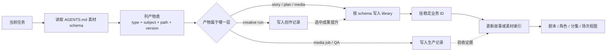
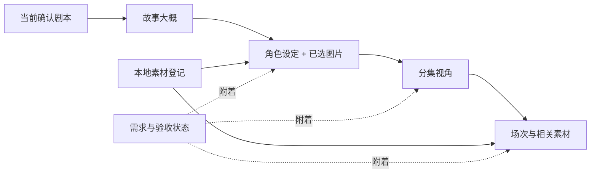

# PRD｜AI 短剧素材中心：剧本业务视图与素材完成度索引

- 状态：`DISCUSSION_DRAFT_V03`
- 日期：2026-08-31
- 参考页面：[DramaBuddy 剧本详情页](https://aicomic.yuewen.com/marketplace/script-market/detail/2090277079074664448)
- 本次范围：产品信息架构、业务索引、Agent 项目素材 schema 与技术落地方案
- 本次不授权：修改项目素材、生成媒体、迁移目录、实现程序、提交或发布

> V03 调整：在 V02 的“剧本业务视图”上，新增一套先于任务的“项目素材 schema”：固定会出现哪些文档与媒体、各自放在哪里、怎样命名和挂到剧本对象。这套规则以根 `AGENTS.md` 为主，项目规则只补事实与特例；不新增一堆文件写入硬门禁。现有文件先原地建索引，不因为页面改版而自动搬移、改名或删除。

## 核心结论

项目首先应该像一份可浏览的“剧本档案”，而不是一个文件夹或生产报表。固定业务顺序为：

> **剧本抬头 → 故事大概 → 角色设定 + 已选图片 → 分集视角 → 场次与相关素材**

现有文件树继续保留为“素材文件”入口。结构化索引负责把剧本对象与本地文件关联起来，使用户在看故事、角色或某一集时，同时知道对应图片、声音、场景和道具是否存在、是否验收、是否仍绑定旧版。

这个需求可以同时解决“Agent 越做文件越乱”，但不能把希望寄托在文件夹名称上。正确的双层结构是：

1. **剧本业务索引是语义事实源**：角色、分集、场次和素材关系使用稳定 ID，不靠目录名猜。
2. **标准目录是人的浏览界面**：根 `AGENTS.md` 像数据库 schema 一样先声明素材类型、目标目录和命名形式，Agent 不再根据当次感觉新建文件夹。

所以，第一版要同时交付“业务视图”和“Agent 素材 schema”；路径辅助工具可以后续添加，但只是降低写错概率，不是新的必经审批系统。历史目录的实体整理是独立、可审核的迁移任务，不当作 UI 上线的隐式副作用。

完成度仍按下面的关系计算，但它只作为业务对象上的附属状态：

> **完成度 = 已满足并验收的业务需求 / 当前里程碑要求的业务需求**，不是“已有文件数 / 猜测文件数”。

视频关键帧、动作板、连续性帧等作为二级“衍生素材”自动归档；除非某个镜头明确把它们升级为必需项，否则不进入第一版基础素材完成度。

## 1. 产品问题与参考页结论

### 1.1 用户真正需要的不是另一种素材分类

现有页面能回答文件在哪里、多少个、怎样预览，却不能让用户在几秒内理解：

- 这是什么故事，核心矛盾是什么；
- 有哪些主要角色，每个人是谁、长什么样；
- 一共有多少集，每集发生了什么；
- 当前看见的角色、场次与真实本地素材是什么关系；
- 哪些故事对象已经有可用素材，哪些仍缺失或绑定错误。

因此不能只在文件页上再增加“人物/场景”筛选。产品需要一层独立于文件夹的剧本业务模型。

### 1.2 参考页面值得借鉴的结构

已实际查看参考页当前可见页面。它采用“左侧固定目录 + 中间长文内容 + 右侧剧本信息”的结构，核心内容顺序是：

1. 剧本标题与基础信息；
2. 故事大纲；
3. 角色设定；
4. 分集正文，并提供逐集目录。

参考页还包含剧本评分、购买和收藏等商城信息，这些不属于本地创作项目的业务主轴。当前样例的角色卡使用姓名首字占位，但已经把“姓名、角色类型、性格、人物小传”集中在一起；本项目应在此基础上换成已选定的真实角色图。分集正文继续按“集 → 场 → 出场人物 → 正文”展开。这个顺序符合用户从全局理解故事、建立人物记忆、再进入逐集阅读的过程。

| 借鉴 | 在本项目中的调整 |
| --- | --- |
| 剧本内容有固定阅读顺序 | 固定为“剧本抬头 → 故事大概 → 角色设定 + 图片 → 分集” |
| 左侧目录可直达故事、角色和每一集 | 保留稳定深链，但不把 32 集正文一次性全部加载 |
| 角色设定先于分集正文 | 角色卡优先显示当前项目内已验收人物图，而不是只显示姓名首字 |
| 分集正文标明场次和人物 | 分集详情进一步关联场景图、人物当前造型、声音和关键道具 |
| 右侧展示剧本附加信息 | 本地工具改为上下文素材/缺口区；不复制评分、购买、收藏等商城能力 |

### 1.3 当前项目已经有业务事实，但缺少统一视图

以 `limited-marriage-escape-bride` 的当前本地事实为例：

- 已有完整的 32 集剧本，资源总表登记其中 92 个场次；
- 已有 3 位核心人物及 3 张已验收的 EP01 人物标准图；
- 3 张 EP01 场景图仍是单机位 `DRAFT / NOT_GEN_INPUT`；
- 3 张道具图仍是 `DRAFT / HUMAN_CONFIRMATION_REQUIRED`；
- 江砚秋、霍景深、夏淼、林特助 4 位人物已有项目专属声音锚点，但苏晚晴的对白声音仍被 EP01 分镜明确标为 `MISSING`；
- 视频数量为 0，EP01 分镜表的 20 个单元全部仍为 `BLOCKED_BY_ASSETS`；
- 最新资源总表已经登记江砚秋 EP01 婚礼策划师标准图为 `ACCEPTED`，但旧分镜引用仍指向另一个 `DRAFT` 候选图。

用户截图中的文件页只能显示“74 个文件”；本轮盘点时 `library/` 已有 79 个物理文件。无论数字是 74 还是 79，新的剧本视图都应该先显示故事、3 位核心人物图片和 32 集结构，再在对应角色或场次上暴露上述状态。

### 1.4 不能直接把现有 Markdown 当成长期接口

现有剧本、资源总表和分镜表适合人读，也适合作为一次性建索引依据，但不适合作为网页长期依赖的结构化接口：

- 剧本文件名、文档顶部状态与当前用户决定可能不同步；
- 故事大概、人物小传和分集摘要不一定存在于同一份 Markdown；
- 同一个人物有身份源、当前造型、候选造型、旧版和被替代版；
- 同一场景可能已有草稿，但仍缺生产所需的多视角母版；
- 分镜可能仍绑定旧资产，不能因为新资产存在就静默替换；
- 自由文本格式变化会让解析结果漂移。

因此，第一版需要建立一个小而明确的项目级“剧本业务索引”；Markdown 继续保留为正文事实源、人读文档和审计证据。

### 1.5 当前目录与文档的实际问题

2026-08-31 对当前实际工作区做了只读盘点。仓库没有 `.env.local`，因此实际工作区仍是仓库内被 Git 忽略的 `workspace/`。`limited-marriage-escape-bride` 的当前文件分布是：

| 区域 | 当前物理文件数 | 实际职责 | 当前问题 |
| --- | ---: | --- | --- |
| `library/` | 79 | 页面可浏览的剧情、图片、音频和视频 | 有类型目录，但剧本正文、制作合同、分镜提示词仍都被归到“剧情” |
| `创作记录/` | 1,331 | 豆包任务、渲染稿、原始响应、选中运行和校验脚本 | 915 个 JSON、226 个 TXT、164 个 Markdown、26 个 MJS；如果逐文件进业务索引，会立即淹没正式成果 |
| `生产记录/` | 5 | 下载件、抽帧和 QA 证据 | 职责正确，但还没有与角色/场次的统一登记契约 |
| `交付包/` | 1 | 已对外或待交付的明确包 | 没有通用交付清单结构 |
| `回收站/` | 11 | 可恢复的历史副本 | 需保留，但不能被剧本视图当成当前素材 |
| 仓库 `docs/projects/limited-marriage-escape-bride/` | 4 | 历史项目文档副本 | 真实项目数据与 Git 程序仓之间已出现双份事实源 |

其中有三组可验证的精确重复：全剧剧本、小说稿和原始大纲在仓库 `docs/projects/...` 与项目 `library/剧情/统一/` 中分别拥有完全一致的 SHA-256。更关键的是，同一份 32 集剧本的仓库副本文件名带 `ACCEPTED`，工作区副本文件名仍带 `DRAFT`，但项目规则又明确记录它已经验收。这说明：

- 文件名中的可变状态会过期；
- “哪份是当前事实源”不能靠重名后的文件名判断；
- 项目成果、过程证据和产品 PRD 不应继续共用仓库 `docs/` 作为默认落点；
- `library/剧情/` 现有 10 份 Markdown，其中 3 份是统一故事文档，7 份是合同或分镜制作文档，仅按扩展名和物理目录无法支撑“故事大概 → 角色 → 分集”的顺序；
- 图片路径同时存在“媒体类型”、“EP01 数字资产包”、“场景名 + 版本”和“正式人物”多种分类维度，Agent 没有唯一的新建规则。

现有顶层目录已经有了合理雏形：`library / 创作记录 / 生产记录 / 交付包 / 回收站`。V03 不再发明一套新根目录，而是在根 `AGENTS.md` 里固定这些目录的职责和下级 schema。Agent 每次创建前先确定“产物类型 + 业务主体 + 目标目录 + 版本”，不得临时发明新分类。

## 2. 固定业务信息架构

### 2.1 项目入口与对象链

项目内第一版只需要两个主要入口：

| 入口 | 职责 |
| --- | --- |
| 剧本 | 默认入口；依次理解故事、角色和分集，并查看其关联素材状态 |
| 素材文件 | 保留现有文件树、搜索、预览和 Finder 定位能力 |

仓库级“导演知识库”继续是独立的全局入口，不混入单个项目的剧本目录。

剧本视图的稳定对象链为：

```text
ProjectStory
├── StoryOverview
├── Character[]
│   └── Look[]
└── Episode[]
    └── Scene[]
```

角色图片、声音、场景图、道具和衍生素材通过业务 ID 挂到这些对象上，不要求它们位于同一个物理文件夹。

推荐路由：

```text
/projects/:projectId/story
/projects/:projectId/story/characters/:characterId
/projects/:projectId/story/episodes/:episodeId
/projects/:projectId/story/episodes/:episodeId/scenes/:sceneId
/projects/:projectId/library/*
```

首页点击项目后默认进入 `/story`。现有 `/library/*` 深链、文件预览、搜索和前进后退行为全部保留。

### 2.2 剧本抬头与故事大概

剧本首页顶部先建立全局认知，不先展示完成度数字：

- 项目名、当前剧本名、绑定版本和决定状态；
- 类型、题材、总集数、当前制作范围；
- 一句话梗概；
- 故事大概；
- 可选的核心矛盾、关系主线和世界规则；
- “打开剧本文档”入口，进入当前绑定的 Markdown 原文。

故事大概必须能追溯到精确剧本版本。AI 可以从剧本提出摘要候选，但用户未确认前标记为 `DRAFT_SUMMARY`，不能覆盖正文事实。

### 2.3 角色设定 + 图片

角色卡是剧本首页的第二个核心区，每张卡至少展示：

- 当前选定人物图；
- 姓名、稳定人物 ID、角色类型（主角、配角、反派等）；
- 一句话人物定位；
- 性格关键词；
- 人物小传；
- 默认主造型及适用集数/场次；
- 备选造型或剧情换装缩略图；
- 声音、专属/常用道具和当前素材缺口；
- 出现的集数和场次数。

人物卡图片选择必须显式、可解释：

1. 优先使用用户已选定的卡片展示图；
2. 没有专门选择时，使用已验收的默认主造型；
3. 只有 `DRAFT` 或候选图时，显示候选状态，不伪装成正式角色图；
4. 没有图片时显示 `MISSING` 占位和缺口，不跨项目借图；
5. 多套造型以缩略图切换，人物身份图与当前造型图的职责不能混淆。

主造型和备选造型不是固定的两个文件槽位，而是 `Look[]`：

- `primary` 表示当前范围的默认造型；
- `alternate` 表示候选或可替换造型；
- `story-required` 表示剧本明确要求的换装或状态版本。

只有 `primary` 和当前里程碑内的 `story-required` 才默认计入必需完成度。单纯为了比较而保留的 `alternate` 不拖低完成度。

### 2.4 分集视角

剧本首页先显示分集索引，不一次渲染 32 集完整正文。每张分集卡展示：

- 集号、集名、2—3 句分集摘要；
- 场次数；
- 主要出场人物头像；
- 主要地点；
- 本集基础素材状态或缺口数量；
- 进入分集详情的稳定链接。

分集详情按 `Episode → Scene` 展开。每个场次至少展示：

- 场次 ID、场景名、内/外、日/夜；
- 当前场次剧本文本或原文定位；
- 出场演员数量、姓名和本场指定造型；
- 场景/空间素材及状态；
- 有对白演员的声音状态；
- 本场关键道具；
- 基础素材齐套状态和明确缺口；
- 已生成的关键帧、动作板、连续性帧数量，默认折叠且不影响基础完成度；
- “打开相关文件”入口，回到现有文件视角。

场次不是文件夹的别名。一个场次可以复用同一地点，也可以引用散落在不同目录中的人物、声音和道具；剧本页通过稳定 ID 关联，文件页继续展示真实目录。

### 2.5 完成度如何嵌入剧本视图

第一版不把“制作总览”设为默认页面，也不在故事上方摆一个含义模糊的大百分比。状态附着在用户正在理解的对象上：

- 角色卡：主造型、声音、必需换装和专属道具状态；
- 分集卡：本集缺失项数量和是否属于当前里程碑；
- 场次详情：场景、出场人物造型、声音和关键道具的逐项状态；
- 页面级“只看缺口”：作为筛选或侧栏，不改变剧本阅读顺序。

下面是当前 EP01 资料可能形成的状态示意，不是已经生成的索引结算结果：

```text
江砚秋｜主造型已验收｜EP01-S01 仍绑定旧候选
苏晚晴｜新娘造型已验收｜对白声音缺失
EP01-S01｜2 位角色｜化妆间母版制作中｜1 个声音缺口
EP01-S03｜2 位角色｜婚礼后台母版制作中｜画夹待验收
```

### 2.6 UI 展示方案仍可讨论

本 PRD 先冻结信息顺序和深链，不锁死视觉形式。可以比较三种展示：

| 方案 | 形态 | 优点 | 风险 |
| --- | --- | --- | --- |
| A. 参考页式长文 | 左侧目录，中间依次铺故事、角色、全部分集 | 阅读连续，最接近参考页 | 32 集过长，首次加载重，定位和移动端体验差 |
| B. 完全分页 | 故事、角色、分集分别成为独立页面 | 每页简单，加载轻 | 用户需要频繁切换，故事与人物关系容易割裂 |
| C. 混合式，推荐 | 首页连续展示故事大概、角色卡和分集索引；人物/分集点开独立详情 | 保留整体认知，又能承载 32 集和大量素材 | 需要设计好桌面上下文区和移动端折叠 |

推荐先以 C 做交互原型：

```text
┌─────────────────────────────────────────────────────────────┐
│ 项目抬头                 [剧本] [素材文件]                   │
├──────────────┬──────────────────────────┬───────────────────┤
│ 故事大概     │ 故事大概                 │ 当前对象素材/缺口 │
│ 角色设定     │                          │                   │
│ 分集正文     │ 角色卡 + 已选图片        │ 点击角色或场次后  │
│  EP01        │                          │ 更新上下文        │
│  EP02 ...    │ 分集索引 / 当前分集详情  │                   │
├──────────────┴──────────────────────────┴───────────────────┤
│ 当前里程碑和缺口仅作为状态，不抢占阅读主线                  │
└─────────────────────────────────────────────────────────────┘
```

桌面端可以保留左侧稳定目录和可折叠右侧上下文区；约 390 px 手机宽度下改成顶部章节切换，素材/缺口放进底部抽屉或正文折叠区。是否保留右侧上下文区、角色卡横排还是纵排，应在真实 EP01 数据原型后再决定。

## 3. 完成度口径

完成度是覆盖在剧本对象上的状态层，不是新的内容层。删除这个状态层后，故事、角色和分集仍然应该完整可读；加入状态层后，用户可以在原位置判断相应素材是否满足生产要求。

### 3.1 先定义需求，再判断素材

引入核心对象 `Requirement`。一个需求项表达“当前里程碑为了某个人物或场次，必须具备什么”：

| 示例需求 | 业务主体 | 所需职责 |
| --- | --- | --- |
| 江砚秋 EP01 婚礼策划师造型 | 人物 + 造型 | `character-standard` |
| 苏晚晴对白声音 | 人物 | `voice-anchor` |
| EP01-S03 婚礼后台母版 | 场次 + 地点 | `scene-master` |
| EP01-S03 苏晚晴旧画夹 | 场次 + 道具 | `prop-standard` |

素材文件只是满足需求的证据。一个需求可以绑定多个候选素材，但只有精确匹配职责、状态和使用范围的素材才能把它变成“已齐套”。

### 3.2 状态定义

| 业务状态 | 判定 |
| --- | --- |
| `MISSING` | 必需需求没有任何可用绑定 |
| `IN_PROGRESS` | 已有文件，但只有 `DRAFT`、`INTERNAL`、未验收候选或不完整版本 |
| `READY` | 文件真实存在，职责和主体精确匹配，且已通过当前用途所需验收 |
| `BLOCKED` | 文件缺失、哈希/路径失效、造型冲突、旧绑定、跨项目引用或状态证据冲突 |
| `NOT_DUE` | 已登记，但不属于当前里程碑，不进入分母 |

`ACCEPTED` 文件也不能只凭文件名认定。状态事实优先级建议为：

1. 显式资产登记与对应验收证据；
2. 已确认的一次性迁移结果；
3. 文件名和目录标签，只能作为提示或自动匹配候选。

### 3.3 场次齐套规则

第一版场次“基础素材齐套”建议采用以下规则：

```text
场景母版 READY
AND 所有可见具名人物的本场造型 READY
AND 所有本场说话人物的声音 READY
AND 所有关键剧情道具 READY
= 场次基础素材 READY
```

关键帧、动作板、连续性帧默认不参与这个公式。若某个复杂动作或构图被导演计划显式标记为 `requiredForGeneration=true`，它才成为该场次的额外必需需求。

“基础素材 READY”也只表示这组业务素材齐套，不代表视频已生成、已播放、可剪辑或已获用户接受。

## 4. 项目级数据设计

不扩张当前最小化的 `project.json`。在每个项目根目录新增本地、Git 忽略的业务索引目录：

```text
<workspace-root>/<project-id>/
├── project.json
├── production/
│   ├── story-index.v1.json
│   └── asset-bindings.v1.json
└── library/
```

两份文件分开，是为了避免自动登记新素材时覆盖人工确认的故事、角色和分集结构。

### 4.1 `story-index.v1.json`：剧本讲什么、需要什么

它保存可追溯的剧本业务结构、当前里程碑和明确需求，不保存缩略图 URL 或派生完成度。示意：

```json
{
  "schemaVersion": 1,
  "sourceBindings": [
    {
      "materialType": "story.source",
      "kind": "shooting-script",
      "path": "剧情/统一/限时婚约-红果短剧版-32集正式剧本-DRAFT-v01.md",
      "sha256": "df7379538d0ab78199b43e7b9cd14de8c1c3bca6490663b3eb55e74d76e1a206",
      "decisionStatus": "ACCEPTED",
      "legacyPath": true
    }
  ],
  "documentBindings": [
    {
      "materialType": "plan.shot",
      "path": "剧情/前期制作/EP01-分镜提示词-v02/EP01-红毯成空-分镜提示词-DRAFT-v02.md",
      "subject": {
        "episodeId": "EP01"
      },
      "legacyPath": true
    }
  ],
  "story": {
    "title": "限时婚约｜逃婚新娘红果版",
    "genre": ["现代", "甜宠", "契约关系"],
    "totalEpisodes": 32,
    "logline": "待从当前已确认剧本生成并由用户确认",
    "synopsis": "待从当前已确认剧本生成并由用户确认",
    "summaryStatus": "DRAFT_SUMMARY"
  },
  "currentMilestone": {
    "id": "EP01_PREPRODUCTION",
    "episodeIds": ["EP01"]
  },
  "requirements": [
    {
      "id": "REQ-EP01-S03-LOCATION",
      "milestoneId": "EP01_PREPRODUCTION",
      "role": "scene-master",
      "subject": {
        "sceneId": "EP01-S03",
        "locationId": "LOC-WEDDING-BACKSTAGE"
      },
      "required": true
    }
  ],
  "characters": [
    {
      "id": "CHAR-001",
      "name": "江砚秋",
      "kind": "human",
      "storyRole": "lead",
      "oneLineSetting": "婚礼策划师，故事女主角",
      "personality": ["待当前剧本索引确认"],
      "biography": "待当前剧本索引确认",
      "defaultLookId": "LOOK-JQ-EP01-PLANNER",
      "cardImageAssetId": "ASSET-CHAR-JQ-EP01-001",
      "looks": [
        {
          "id": "LOOK-JQ-EP01-PLANNER",
          "name": "EP01 婚礼策划师造型",
          "kind": "primary"
        }
      ]
    }
  ],
  "episodes": [
    {
      "id": "EP01",
      "title": "红毯成空",
      "summary": "待从 EP01 正文生成并由用户确认",
      "summaryStatus": "DRAFT_SUMMARY",
      "scenes": [
        {
          "id": "EP01-S03",
          "heading": "内·婚礼后台·日",
          "locationId": "LOC-WEDDING-BACKSTAGE",
          "cast": [
            { "characterId": "CHAR-001", "lookId": "LOOK-JQ-EP01-PLANNER" },
            { "characterId": "CHAR-002", "lookId": "LOOK-HJ-EP01-GROOM" }
          ],
          "propIds": ["PROP-ART-PORTFOLIO"],
          "requirementIds": ["REQ-EP01-S03-LOCATION"]
        }
      ]
    }
  ]
}
```

上例只展示字段形态，不是完整的当前项目数据。`sourceBindings.path`、`documentBindings.path` 和素材路径都以当前项目 `library/` 为根。`documentBindings` 用于把角色设定、分集剧本、素材计划、台词合同和分镜文档挂到业务对象；运行证据不进该列表。故事摘要、人物小传和分集摘要必须保留来源与确认状态，不能因为 AI 已生成文本就自动视为事实。

`Character.kind` 至少允许 `human`、`creature` 和 `other`，使人物、拟人动物或剧情中的具名怪物都能进入同一角色视角，而不强迫它们使用相同的人像规则。

### 4.2 `asset-bindings.v1.json`：现有什么、对应谁

它保存文件与角色、造型、场次等业务对象之间的显式关联。示意：

```json
{
  "schemaVersion": 1,
  "assets": [
    {
      "assetId": "ASSET-CHAR-JQ-EP01-001",
      "materialType": "image.character",
      "path": "图片/人物/正式人物/江砚秋/CHAR-JQ-EP01-WEDDING-PLANNER-STANDARD-ACCEPTED-v01.png",
      "role": "character-standard",
      "subject": {
        "characterId": "CHAR-001",
        "lookId": "LOOK-JQ-EP01-PLANNER"
      },
      "status": "ACCEPTED",
      "legacyPath": true,
      "provenance": {
        "kind": "legacy-bootstrap"
      },
      "verification": {
        "kind": "human-image-review",
        "verifiedAt": "2026-08-30"
      }
    }
  ]
}
```

路径始终是当前项目 `library/` 内的相对路径。不得登记绝对路径、其它项目路径、符号链接或第三方画布节点作为本地生产资产。

角色卡通过稳定 `assetId` 选择展示图；如果该文件缺失、失效或不再满足当前角色职责，页面显示明确状态，不自动换成另一张名字相似的图片。

### 4.3 派生结果不落盘

以下内容由服务端每次读取时计算，不再维护第三份容易失真的总表：

- 角色卡图片 URL、图片状态和造型缩略图；
- 分集主要角色头像和场次数；
- 人物已齐套/必需数量；
- 场次状态与阻塞原因；
- 未归档文件；
- 已登记但文件缺失的资产；
- 旧绑定和造型冲突；
- 页面需要的安全素材 URL。

如果后续数据量确实变大，可以增加可删除、可重建的缓存，但缓存不能成为事实源。

## 5. Agent 项目素材 schema

### 5.1 先定“表结构”，再让 Agent 创建文件

目录治理的主体不是一个写入拦截器，而是根 `AGENTS.md` 中一套稳定的“项目素材 schema”。它和数据库表结构的作用一样：先规定数据类型、主键、关联和存储位置，然后才允许各个 Agent 写具体内容。

规则分三层，且不重复定义：

| 文件 | 职责 | 不应承担的职责 |
| --- | --- | --- |
| 根 `AGENTS.md` | 全项目通用的素材类型、目录 schema、命名与版本规则 | 不写某部剧的角色决定、当前剧本或当前模型 |
| `<project>/PRODUCTION_RULES.md` | 某部剧的事实源、当前选择、特例和验收状态 | 不重写通用目录 schema，不发明新根目录 |
| Skill `SKILL.md` | 如何创作、生成、下载或验收某类产物 | 不自己决定项目文件最终放哪里，只引用根 schema |

每个 Agent 在创建前必须先确定五个字段：

```text
materialType  产物类型
subject       项目 / 角色 / 造型 / 集 / 场 / 镜头
targetDir     根据 schema 得到的目标目录
version       本次新版本，不覆盖旧版
storyBinding  是否需要进入故事、角色、分集或场次视图
```

如果新产物不属于任何已知 `materialType`，Agent 应先提出 schema 增补建议，而不是临时创建一个新顶层目录。

### 5.2 项目根目录职责

V03 固定现有根目录，不再添加 `workbench`、`output`、`temp`、`final-final` 等同义目录：

```text
<workspace-root>/<project-id>/
├── project.json
├── cover.png | cover.jpg | cover.webp    # 项目封面，由 project.json 引用
├── PRODUCTION_RULES.md              # 项目事实与特例
├── production/                     # 剧本业务索引，机器可读
├── library/                        # 应被人浏览和项目使用的正文/素材
├── 创作记录/                      # Agent/LLM 输入、输出和运行证据
├── 生产记录/                      # 媒体任务、下载、抽帧和 QA 证据
├── 交付包/                        # 经明确交付动作形成的包和清单
└── 回收站/                        # 已授权整理后的可恢复旧文件
```

| 根目录 | 放什么 | 不放什么 |
| --- | --- | --- |
| 项目根固定文件 | `project.json`、它引用的单一 `cover.*`、可选 `PRODUCTION_RULES.md` | 不把剧本、素材总表、prompt 或媒体散放在项目根 |
| `production/` | `story-index.v1.json`、`asset-bindings.v1.json` 以及可重建报告 | 不放原始响应、图片或人读剧本 |
| `library/` | 当前项目需要浏览、阅读、复用和预览的文档/媒体 | 不放 LLM 原始回包、临时校验、抽帧 QA 或未选中运行全量证据 |
| `创作记录/` | prompt、job、raw response、creative output、selected run 等创作链证据 | 不作为剧本页默认正文 |
| `生产记录/` | 任务号、远程 URL 记录、下载件、解码、抽帧和媒体 QA | 不把机器检查件当成已验收素材 |
| `交付包/` | 已明确选定的交付副本和 manifest | 不把所有工作中文件当成交付物 |
| `回收站/` | 明确授权整理时的可恢复文件 | Agent 日常不向这里生成任何新成果 |

仓库级 `docs/` 从 V03 起只放产品 PRD、架构说明和程序维护文档。新的真实项目剧本、人物提示词或素材清单不再写入 `docs/projects/<project-id>/`；当前已有副本作为 legacy 保留，本 PRD 不授权删除。

### 5.3 `library/` 的标准下级 schema

下面是新产物的默认落点。中文名用于人读，`CHAR / LOOK / LOC / PROP / EP / S / U` 稳定 ID 用于索引关联：

```text
library/
├── 剧情/
│   ├── 统一/                                      # 全剧大纲、当前剧本、故事大概
│   │   └── 素材计划/                              # 全项目角色、场景、道具和声音总计划
│   ├── 角色/
│   │   └── CHAR-001-江砚秋/                    # 角色设定、角色关系说明
│   └── 分集/
│       └── EP01/
│           ├── 剧本/                              # 分集剧本或剧本定位稿
│           ├── 素材计划/                          # 人物、场景、道具、声音需求
│           └── 分镜/                              # 台词合同、分镜执行表、统一提示词
├── 图片/
│   ├── 人物/CHAR-001-江砚秋/LOOK-JQ-EP01-PLANNER/
│   ├── 场景/LOC-WEDDING-BACKSTAGE-婚礼后台/
│   ├── 道具/PROP-ART-PORTFOLIO-旧画夹/
│   ├── 剧情/EP01/EP01-S03/                       # 关键帧、动作板、连续性帧
│   └── 参考/                                      # 未承担当前项目正式资产职责的参考
├── 音频/
│   ├── 人物/CHAR-001-江砚秋/                    # 项目专属声音锚点
│   ├── 剧情/EP01/EP01-S03/                       # 台词、时间轴音频
│   ├── 环境/LOC-WEDDING-BACKSTAGE-婚礼后台/
│   └── BGM/
└── 视频/
    ├── 剧情/EP01/EP01-S03/                           # 分镜片段和候选片段
    ├── 参考/
    └── 成片/EP01/
```

物理路径不是业务主键。例如角色改名、场景复用或分集调整时，剧本视图仍以 `CHAR-001`、`LOC-WEDDING-BACKSTAGE`、`EP01-S03` 等 ID 为准。目录 schema 只负责让新文件不再乱放。

### 5.4 素材类型字典

根 `AGENTS.md` 应固定以下 `materialType`。这就是 Agent 在创建文件前要查的“表结构”：

| `materialType` | 业务主体 | 默认目录 | 是否进剧本视图 |
| --- | --- | --- | --- |
| `story.source` | 全项目 | `library/剧情/统一/` | 是，作为当前剧本/大纲来源 |
| `story.summary` | 全项目 | `library/剧情/统一/` | 是，展示故事大概及确认状态 |
| `story.character-setting` | `characterId` | `library/剧情/角色/<CHAR-ID-姓名>/` | 是，与角色图一起展示 |
| `story.episode-script` | `episodeId` | `library/剧情/分集/<EP>/剧本/` | 是，作为分集正文或原文定位 |
| `plan.asset-project` | 全项目 | `library/剧情/统一/素材计划/` | 是，用于全剧素材总览与缺口 |
| `plan.asset-episode` | `episodeId` 及可选 `sceneId` | `library/剧情/分集/<EP>/素材计划/` | 是，用于解释当集需求和缺口 |
| `plan.shot` | `episodeId / sceneId` | `library/剧情/分集/<EP>/分镜/` | 上下文展示，不抢第一层阅读主线 |
| `contract.dialogue` | `episodeId / sceneId / characterId` | `library/剧情/分集/<EP>/分镜/` | 在场次和声音缺口中展示 |
| `prompt.image` | 角色、场景或道具主体 | 与目标图片相同的业务目录 | 只从素材来源打开，不当作图片 |
| `prompt.video` | `episodeId / sceneId / shotId` | `library/剧情/分集/<EP>/分镜/` | 与对应镜头上下文展示 |
| `prompt.voice` | `characterId` | `library/音频/人物/<CHAR>/` | 只从声音素材来源打开 |
| `image.character` | `characterId + lookId` | `library/图片/人物/<CHAR>/<LOOK>/` | 是，挂主造型、备选造型 |
| `image.scene` | `locationId` | `library/图片/场景/<LOC>/` | 是，挂场次场景素材 |
| `image.prop` | `propId` | `library/图片/道具/<PROP>/` | 是，挂角色或场次道具 |
| `image.derived` | `sceneId` 或 `shotId` | `library/图片/剧情/<EP>/<SCENE>/` | 默认折叠，不进基础完成度 |
| `audio.voice` | `characterId` | `library/音频/人物/<CHAR>/` | 是，挂角色声音 |
| `audio.scene` | `sceneId` | `library/音频/剧情/<EP>/<SCENE>/` | 是，挂台词/时间轴 |
| `audio.ambient` | `locationId` | `library/音频/环境/<LOC>/` | 在场次素材中展示 |
| `audio.bgm` | 全项目或 `episodeId` | `library/音频/BGM/` | 在项目或分集声音区展示 |
| `video.shot` | `sceneId + shotId` | `library/视频/剧情/<EP>/<SCENE>/` | 作为二级镜头素材 |
| `video.final` | `episodeId` | `library/视频/成片/<EP>/` | 在分集上显示，验收状态单独计算 |
| `media.reference` | 可选业务主体 | `library/<图片|音频|视频>/参考/` | 否，默认不满足任何正式需求 |
| `record.creative` | workflow/run | `创作记录/<agent>/<workflow>/<run-id>/` | 否，只从来源追溯中打开 |
| `record.production` | media job/QA | `生产记录/<purpose>/<scope>/<job-id>/` | 否，只从验收证据中打开 |
| `delivery.package` | delivery ID | `交付包/<delivery-id>/` | 否，在交付记录中展示 |

参考图、参考音频和参考视频使用同一逻辑：放在对应媒体根的 `参考/`，默认不满足任何业务需求；需要升级为正式素材时，以新版本写到具体业务目录并登记。

### 5.5 命名、版本与运行目录规则

新文件使用“稳定主体 + 产物职责 + 版本”命名，不把会变的审核状态继续写进文件名。

| 产物 | 建议文件名 |
| --- | --- |
| 当前全剧剧本 | `STORY-SCRIPT-红果32集-v01.md` |
| 故事大概 | `STORY-SUMMARY-v01.md` |
| 角色设定 | `CHAR-001-SETTING-v01.md` |
| 分集剧本 | `EP01-SCRIPT-红毯成空-v01.md` |
| 全项目素材计划 | `PROJECT-ASSET-PLAN-v01.md` |
| 分集素材计划 | `EP01-ASSET-PLAN-v01.md` |
| 场次分镜计划 | `EP01-S03-SHOT-PLAN-v01.md` |
| 人物标准图 | `CHAR-001-LOOK-JQ-EP01-PLANNER-STANDARD-v01.png` |
| 场景图 | `LOC-WEDDING-BACKSTAGE-MASTER-FRONT-v01.png` |
| 道具图 | `PROP-ART-PORTFOLIO-STANDARD-v01.png` |
| 关键帧 | `EP01-S03-U04-KF-v01.png` |
| 分镜片段 | `EP01-S03-U04-VIDEO-v01.mp4` |
| 分集成片 | `EP01-FINAL-v01.mp4` |
| 图片生成提示词 | `<SUBJECT-ID>-IMAGE-PROMPT-v01.md` |
| 视频分镜提示词 | `EP01-S03-U04-VIDEO-PROMPT-v01.md` |

具体规则：

- `DRAFT / ACCEPTED / REJECTED / SUPERSEDED` 放在业务索引或素材登记中，不再放进新文件名；这样状态改变时不需要重命名。
- 新版本使用 `vNN`，永不覆盖旧版；当前版本由索引指向，不创建 `final`、`最终版`、`最终版2` 等文件名。
- 项目索引使用稳定 ID，文件名中的中文标题只用于人读。
- 不创建符号链接、不引用其它项目路径，不用另一份同名文件暗示“当前版”。

Agent 运行证据不按 1,331 个文件逐个进剧本索引。它们按一次 run 归组，组内文件名固定：

```text
创作记录/<agent>/<workflow>/<run-id>/
├── prompt.md | prompt.txt
├── job.json
├── run.json
├── raw-response.json | raw-stdout.txt
└── creative-output.md
```

从运行中选中的正式成果按对应 `materialType` 以新版本落到 `library/`，并在索引里保留来源 run 关系；`creative-output.md` 本身不直接当成当前剧本。

### 5.6 建议写入根 `AGENTS.md` 的 Agent 行为契约

以下规则可在实现阶段直接整理进根 `AGENTS.md`：

1. 创建项目文件前，先读根 `AGENTS.md`、当前 `project.json`、项目 `PRODUCTION_RULES.md` 和当前索引。
2. 先列出本次预计产物的 `materialType / subject / targetDir / version / storyBinding`，再开始创作或生成。
3. 一个产物只选一个主要职责和默认落点；同一文件不因为同时涉及人物、场景和分镜就复制到三个目录。
4. 找不到对应类型时，先提议修改 schema，不创建新顶层目录或“其他/杂项/暂存”。
5. 正式项目成果只进当前工作区的当前项目；不向仓库 `docs/projects/`、其它项目或绝对路径写生产副本。
6. 新版本永不覆盖旧文件；状态变化更新索引，不通过重命名表达。
7. 能在剧本、角色、分集或场次页出现的文件，必须挂稳定业务 ID；运行证据和 QA 文件保留在各自记录目录，不进阅读主线。
8. 任务结束时报告“创建了哪些正式成果、哪些运行证据、更新了哪些索引”，不用一句“文件已生成”混合报告。

### 5.7 轻量辅助，不建新审批系统

实现时可以提供一个轻量路径建议器，根据 `materialType + subject + version` 返回建议目录和文件名。Agent 也可以直接按 `AGENTS.md` 创建，不强制所有写入经过代理 API。

本期明确不做：

- 不要求每个 Agent 先向审批服务申请文件路径；
- 不为 `创作记录/` 里的每个 JSON、TXT 和 Markdown 单独创建业务登记；
- 不因为旧文件不符合新 schema 而阻断剧本视图读取；
- 不让 lint 自动重命名、搬移、删除或覆盖任何文件；
- 不把“通过目录检查”当成图片、音频或视频的内容验收。

可选的只读盘点脚本只给提示，不自动修复：

- `UNKNOWN_MATERIAL_TYPE`：出现 schema 外的新类型或顶层目录；
- `NONSTANDARD_PATH`：新文件放在与类型不一致的目录；
- `MISSING_BUSINESS_ID`：应进剧本视图的文件没有业务主体；
- `UNREGISTERED_STORY_ASSET`：已在 `library/` 但尚未进角色/场次关联；
- `STATUS_IN_NEW_FILENAME`：新文件继续在名称中写可变状态；
- `DUPLICATE_PROJECT_COPY`：项目工作区外又出现同哈希正式副本。

这些是帮 Agent 在交付前发现偏离的 lint，不是新的业务门禁，更不能自动搬移、删除或改名现有文件。项目路径边界、不跨项目依赖、不覆盖/删除未授权资产仍是已有安全约束，不属于本需求新增的门禁。

### 5.8 历史文件的处理

schema 对新产物立即生效，对历史文件则分两步：

1. **先原地映射**：在 `story-index.v1.json` 和 `asset-bindings.v1.json` 里登记当前真实路径、哈希、`materialType` 和业务 ID，对非标准路径加 `legacyPath: true`。剧本视图先能正确展示，不等待目录搬完。
2. **再单独迁移**：输出“旧路径 → 建议新路径 → 哈希 → 需修复引用”清单。只有用户明确授权后才复制、校验、改索引，默认保留旧文件；删除需要另行授权。

对当前三组完全同哈希的 `docs/projects/...` 副本，第一步只在报告中标记 `DUPLICATE_PROJECT_COPY`，并将工作区 `library/` 中的副本绑定为项目生产事实。不删 Git 历史文档，也不因为文件名中的 `DRAFT / ACCEPTED` 不同就复制出第三份。

### 5.9 Agent 产物进入剧本视图的流程



这里的“更新索引”只发生在产物确实要进业务视图时。原始 prompt、raw response、抽帧图和调试 JSON 不因为是 Agent 创建的，就自动成为故事素材。

## 6. 自动索引流程



这张图表达页面阅读顺序。实现内部由 `story-index.v1.json` 提供剧本对象，由 `asset-bindings.v1.json` 和实时 `library` 扫描提供图片与其它素材，再统一生成页面只读模型。

### 6.1 “自动加上索引”的准确含义

仅扫描文件名无法可靠知道一张图片是主造型、备选造型，还是某场的关系关键帧。最省心的自动化时机是生成/导入任务保存文件的那一刻：任务本来就知道 `materialType`、`characterId`、`lookId`、`sceneId` 和 `role`，可以在按 schema 保存后顺手更新素材登记。

这是 Agent 的默认工作流，不是文件系统的写入硬门禁。如果某个 Agent 直接按 `AGENTS.md` 创建了文件，只要它同步完成业务绑定，效果与调用辅助函数一样；如果没有登记，页面将它列为“待归档”，不自动猜关系。

项目可以提供两个共用函数，避免页面、Agent 和导入脚本分别重写绑定逻辑：

```ts
readProjectStory(projectId, selection?): Promise<ProjectStoryReadModel>
registerAsset(projectId, input): Promise<AssetRegistrationResult>
```

模块内部负责读取剧本业务索引、组装角色图片与分集数据、原子写入素材登记、路径校验、去重、状态归一、文件存在性、旧绑定检查和完成度计算。它是复用实现，不取代 `AGENTS.md` 中人和 Agent 都能读懂的 schema。

自动登记规则：

1. 生成或导入任务先按 `materialType` schema 把文件安全保存到当前项目 `library/`；
2. 再携带明确业务 ID 和职责调用 `registerAsset`；
3. 登记成功后，人物和场次视图自动更新；
4. 只有文件名、没有明确语义的素材进入“待归档”；
5. 文件名能唯一匹配已知 ID 时可以生成建议，但不自动把它升级成 `ACCEPTED`；
6. 文件被移动、缺失或哈希不一致时显示 `BLOCKED`，不得静默回退到同名旧素材。

### 6.2 衍生素材的处理

关键帧、动作板、连续性帧和视频片段登记到对应 `sceneId` 或更细的 `shotId`，页面默认放在“衍生素材”折叠区：

- 自动显示已有数量和最新状态；
- 不进入基础素材分母；
- 不因缺失而把整个人物或整集标红；
- 只有导演计划显式要求时，才升级为当前场次的必需需求。

## 7. 服务端与前端落点

### 7.1 服务端

建议新增 `server/projectStoryCatalog.ts`，作为一个深模块：

- 输入：项目 ID；
- 内部读取：`story-index.v1.json`、`asset-bindings.v1.json` 和实时 `library` 扫描结果；
- 输出：页面可直接使用的剧本抬头、故事大概、角色卡、分集索引或指定分集详情；
- 内部处理：角色展示图选择、分集与场次组装、状态归一、需求满足、冲突检测、未归档列表和安全 URL；
- 安全要求：延续当前项目真实路径校验，不向前端返回本机绝对路径，不扫描其它项目。

第一版读取接口建议为：

```text
GET /api/projects/:projectId/story
GET /api/projects/:projectId/story/episodes/:episodeId
```

第一个接口返回剧本抬头、故事大概、角色卡和全部分集摘要；第二个接口按需返回一集的正文定位、场次和关联素材。这样不会在打开项目时加载 32 集完整正文，也不会让前端分别读取多个 Markdown 后自行拼装业务关系。

登记写接口应在实现自动生成/导入衔接时再开放，并使用原子写入；第一期只读页面不需要为了“看起来完整”提前增加网页编辑能力。

### 7.2 前端

建议新增：

```text
src/pages/ProjectStoryPage.tsx
src/pages/ProjectCharacterPage.tsx
src/pages/ProjectEpisodePage.tsx
src/lib/projectStory.ts
src/types/story.ts
```

现有 `src/lib/production.ts` 的文件名标签解析继续服务文件卡片，但不能再承担业务完成度判断。

页面共同遵守：

- 路由是当前视角、人物、集数和场次的事实源；
- 剧本首页按“故事大概 → 角色设定 + 图片 → 分集索引”稳定渲染；
- 卡片上的状态都能点开查看“需求 → 绑定文件 → 验收证据/冲突”；
- 每个业务对象都能跳到相关文件；
- 桌面与约 390 px 手机宽度都能理解故事、查看角色图、切换分集、展开场次和打开素材；
- 首页仍只读项目元数据，进入项目后才读取该项目生产索引和 `library`。

### 7.3 验证策略

`projectStoryCatalog` 依赖的是本地文件系统，可以使用临时项目工作区作为本地替身。测试应穿过模块的公开接口验证页面可观察结果，不直接绑定内部解析函数：

- 给定一个剧本索引和素材登记，返回顺序正确的故事、角色与分集模型；
- 角色展示图缺失、为草稿或跨项目时返回明确状态；
- 选择 EP01 时只返回 EP01 详情，不读取其它集正文；
- 新增未登记文件不改变故事结构与完成度；
- 旧造型绑定、缺失声音和场景草稿形成稳定阻塞结果；
- 路径穿越和符号链接越界继续被拒绝。

## 8. 当前项目的一次性建索引方案

不要让网页首次打开时临时用 AI 重读整部剧本。建议做一次可复核的 bootstrap：

1. 按第 5 章的 `materialType` 对当前项目文件做只读分类，输出标准路径、legacy 路径、过程证据和重复副本清单，本步不搬文件；
2. 绑定用户已经确认的精确剧本路径和 SHA-256；不相信文件名或文档顶部残留状态；
3. 从当前剧本建立剧本抬头、全剧故事大概候选、主要角色候选和 32 集分集摘要候选；每一项保留来源文件、版本和确认状态；
4. 从 32 集剧本标题确定 32 集和 92 个场次，建立集、场与原文定位；
5. 由 AI/脚本提出人物、场地、出场演员、造型、说话人和道具清单，并保留来源集/场；
6. 人工确认故事大概、主要角色设定，以及会改变完成度的业务项；特别核对人物同名、群众演员、场地复用、换装和关键道具；
7. 从当前项目资源总表导入已登记资产与验收状态，并显式选定 3 位核心人物的角色卡展示图；
8. 从 EP01 分镜的 Reference plan 导入当前场次绑定；第一轮只对 EP01 计算精确素材完成度，但 32 集故事目录全部可浏览；
9. 对“新资产已存在但旧分镜仍绑定候选版”的情况生成 `STALE_BINDING`，不自动换绑；
10. 输出未归档文件、缺失文件、跨项目引用和状态冲突报告；
11. 用户确认后才把索引作为页面事实源。

这一步完成后，后续 Agent 先按 `AGENTS.md` 素材 schema 落盘，需进业务视图的成果再同步更新索引；可以使用共用登记函数，但不依赖它才能写文件。

## 9. 分期建议

### M0｜冻结剧本业务索引与 Agent 素材 schema

- 冻结 `ProjectStory / StoryOverview / Character / Look / Episode / Scene / Requirement / AssetBinding` 的最小字段；
- 冻结 `MISSING / IN_PROGRESS / READY / BLOCKED / NOT_DUE` 的判定；
- 冻结第 5 章的 `materialType`、顶层目录职责、下级目录、命名和版本规则；
- 把这套通用 schema 写入根 `AGENTS.md`，项目 `PRODUCTION_RULES.md` 和各 Skill 只引用它，不各写一套路径；
- 对当前文件输出只读分类和重复报告，不搬移、重命名或删除；
- 为 `limited-marriage-escape-bride` 生成全剧故事、主要角色、32 集和 92 场的候选索引；
- 只对 EP01-S01、EP01-S03 等当前制作场次精确验证人物、声音、场景、道具和旧绑定。

### M1｜真实数据 UI 原型

- 使用当前故事大概、3 位核心角色已验收图片、32 集标题和 EP01 三场制作原型；
- 对比长文、完全分页和混合式布局，优先验证推荐的混合式；
- 同时验证桌面和约 390 px 手机宽度；
- 本阶段只确定信息密度、下钻方式和上下文素材区，不增加写入能力。

### M2｜只读剧本页面 MVP

- 新增剧本首页、角色详情、分集/场次详情路由；
- 新增一个服务端剧本目录模块和两个按摘要/分集读取的接口；
- 剧本首页按“故事大概 → 角色设定 + 图片 → 分集索引”展示；
- 32 集目录可浏览，分集详情按需加载，完成度默认只计算当前里程碑；
- 保留现有文件浏览全部能力；
- 不做网页编辑，不做媒体生成，不把关键帧/动作板作为第一优先级。

### M3｜Agent schema 常态化与生成/导入自动登记

- Agent 在创建前按 `materialType / subject / targetDir / version / storyBinding` 列产物表；
- 添加可选路径建议器和只读 lint，但不把它们改造成必经审批系统；
- 为项目内生成、下载和导入流程接入 `registerAsset`；
- 增加“待归档”列表与唯一匹配建议；
- 增加缺失文件、失效绑定和被替代资产告警；
- 仍由真实查看、试听和播放决定验收状态，生成成功不自动变成 `READY`。

### M4｜镜头衍生素材

- 自动聚合关键帧、动作板、连续性帧和视频片段；
- 只有被导演计划显式提升的衍生素材才进入场次需求；
- 增加从场次到镜头/视频的下钻，不改变第一版基础完成度口径。

## 10. MVP 验收标准

1. 从项目首页进入短剧后，默认打开剧本视图，不再先打开全部素材文件。
2. 剧本首页按“故事大概 → 角色设定 + 图片 → 分集索引”形成清晰阅读顺序。
3. 3 位核心角色显示当前项目内明确选定的图片；没有已验收图时显示缺口，不跨项目或静默选择候选图。
4. 页面能浏览 32 集目录；点击一集后只加载该集详情，并保留可刷新、可复制的深链。
5. 分集详情能看到场次、出场人物、指定造型、地点和关键道具，并能跳到相关本地文件。
6. 一张 `DRAFT` 场景图存在时，场景显示“制作中”，不能显示“已齐套”。
7. 同一人物的错误造型不能满足当前场次的人物需求。
8. 新的已验收人物标准图存在，但场次仍绑定旧候选图时，显示“可改绑 + 当前冲突”，不能自动替换。
9. 缺少说话人物声音时，对应场次明确显示人物名和缺口。
10. 向项目增加 100 个未登记图片，故事、角色和分集结构不变化，基础素材完成度也不变化，只增加“待归档”。
11. 关键帧和动作板能自动显示在场次下，但默认不影响基础素材完成度。
12. 业务页面不返回绝对路径，不接受跨项目素材；现有文件深链、预览、搜索、刷新、前进后退和移动端布局不回归。
13. 根 `AGENTS.md` 明确列出第 5 章的素材类型、业务主体、默认目录和命名规则，新 Agent 不需根据旧对话猜路径。
14. 新 Agent 任务在创建前能列出 `materialType / subject / targetDir / version / storyBinding`，任务结束后能分开报告正式成果、运行证据和索引更新。
15. 正式剧本、角色设定、素材计划和选中媒体按 schema 进 `library/`；原始 prompt、raw response、抽帧和 QA 证据保留在记录目录，不进剧本阅读主线。
16. 新的真实项目成果不再写到仓库 `docs/projects/<project-id>/`；产品 PRD 和程序说明仍保留在仓库 `docs/`。
17. 新文件的审核状态从索引读取；文件从 `DRAFT` 变为 `ACCEPTED` 时不需重命名或再复制一份。
18. 当前 legacy 路径即使不符合新 schema，也能通过 `legacyPath` 映射正常进入剧本视图，不必先搬目录。
19. 路径建议器和 lint 可以不存在，Agent 仍能仅依据 `AGENTS.md` 正确完成创建和登记；它们不是业务写入硬门禁。

## 11. 推荐先做的最小闭环

先用当前 `limited-marriage-escape-bride` 做一个“全剧可读、EP01 可生产核对”的样板：

1. 先确认第 5 章的素材字典和目录树，然后把通用规则写入根 `AGENTS.md`；
2. 对当前项目输出一份只读的 `legacy 路径 → materialType → 业务主体` 映射，不先搬文件；
3. 建立全剧故事大概候选、3 位核心人物设定、32 集标题/摘要候选和 92 场原文定位；
4. 角色卡使用当前 3 张已验收 EP01 人物标准图，明确主造型、声音和道具状态；
5. 分集索引展示全部 32 集，但只为 EP01 的 3 个场次导入当前已知场景、声音和道具需求；
6. 让 EP01 详情正确暴露苏晚晴声音缺失、场景母版未完成和江砚秋旧绑定；
7. 用真实内容比较三种 UI 方案，确认阅读与下钻方式后再进入程序实现；
8. 实现后让 Agent 各新建一份剧本类文档和一份媒体素材，验证它们在不经过审批门禁的情况下仍能按 schema 落盘，并更新相关业务视图。

这个闭环最早验证两个价值：用户先能看懂“这是一部什么剧、有哪些角色、32 集怎么展开”，进入制作范围后又能立即知道“EP01 被哪些具体素材缺口阻塞”。
