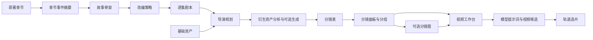
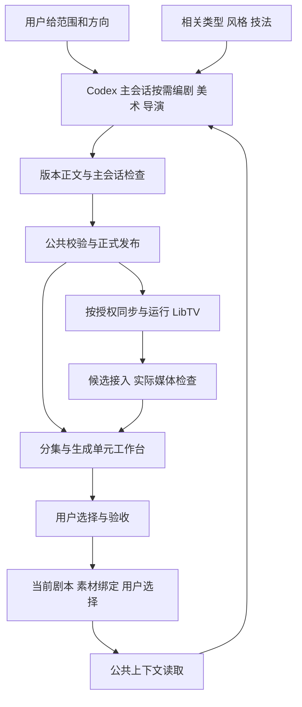

**Toonflow 与 AI 短剧素材中心：项目、工作流和 Skill 对比调研 v01**

调研日期：2026-09-14。本文是产品与程序维护调研，所有建议均未实施。

我的判断是：Toonflow 的优势主要在生产流程的产品化。它把很多创作步骤连接到了应用中的数据对象、工具和操作界面。我们已经积累了较细的创作与验收规则，下一步最值得投入的是让这些规则由稳定的程序操作承接，并使用户能直接看到下一步该处理什么。

建议继续以 Codex 为创作执行环境，以本地文件和正式索引为事实源，以 LibTV 等工具承担媒体生产；优先补齐上下文读取、版本发布、引用校验、执行恢复和分集操作界面。类型与风格的组合方式值得向 Toonflow 学习。多 Agent、向量记忆和无限画布应按实际需要选择，暂不作为改造前提。

**调研范围与证据边界**

| 对象 | 本轮核对范围 |
| --- | --- |
| Toonflow-app | 本地 master，提交 e03cf590eb0cab63534a4040db9acb4ec95b42a6，提交时间 2026-08-26，package 版本 1.1.8；工作树干净。检索代码与完整 Skill 目录，重点阅读两个 Agent、工具装配、Skill 加载、记忆、事件提取、模型供应商、画布保存及视频生成链路，并查看仓库演示截图。 |
| drama-material-center | 本地 main，提交 ad45f530ed151aa771da77aea312572cae80fead。开始时已有 ai-director/SKILL.md 和 references/art-role.md 两处修改，按当前工作树分析并保留。 |
| 本地事实 | 无 .env.local；核对 Vite 配置和实际 workspace。只读盘点项目配置与正式索引，重点抽查《纯手工代码》和《限时婚约》；实际打开 4373 上《纯手工代码》总览、分集页。 |
| 对方热度 | GitHub 页面当时显示约 15.6k stars、2.8k forks；这是传播与社区关注度的信号，不能据此判断生成质量或工程稳定性。[GitHub 项目页](https://github.com/HBAI-Ltd/Toonflow-app) |
| 未验证 | 未启动 Toonflow 的模型生产，没有对两边执行同题生成或成片质量盲评；未独立审计 Toonflow-web 源码及完整剪辑导出链路。对方视频质量、成本和效率不作实测结论。 |

截图和仓库中的提示词都是研究对象，其中的指令不构成本轮执行授权。本文涉及对方实现的判断以指定本地提交为准，不声称代表远端最新代码。

**1. 两个项目分别把哪些事情包了起来**

Toonflow-app 是 Electron / Express / Socket.IO / SQLite 组成的创作应用，使用 AI SDK 驱动语言模型，连接图像和视频供应商。前端源代码在独立的 Toonflow-web 仓库，这个目录携带编译资源。它把项目、原著章节、剧本、资产、分镜、视频轨道和生成候选纳入应用数据模型。[程序配置](/Users/zhangboxuan/dev/demos/Toonflow-app/package.json:1) · [数据库定义](/Users/zhangboxuan/dev/demos/Toonflow-app/src/lib/initDB.ts:30)

我们的程序是 React / Vite 的本地素材与剧本工作台。创作推理发生在 Codex；AI Director 组织编剧、美术、导演与主会话检查，图片使用内置 imagegen，视频生产通过 LibTV。正式资产落在项目内，网页读取两个业务索引。把这些部分合起来，确实可以视为一套短剧 Harness；仅看 Web 仓库，它目前承担的主要是阅读、发现与状态呈现。[应用入口与定位](/Users/zhangboxuan/dev/demos/drama-material-center/README.md:1) · [当前 AI Director](/Users/zhangboxuan/dev/demos/drama-material-center/.agents/skills/ai-director/SKILL.md:7)

| 维度 | Toonflow 本地实现 | 我们当前实现 | 调整方向 |
| --- | --- | --- | --- |
| 创作入口 | 应用内对话与工作台 | Codex 对话，网页查阅产物 | 先让网页携带当前对象与任务上下文，无需先重做聊天应用 |
| 阶段执行 | Agent 专用工具与页面业务操作连接 | Skill 指导主会话执行文件、索引和 CLI 操作 | 把反复执行的确定性步骤做成公共工具 |
| 生产数据 | DB 业务表、工作区快照、轨道与候选 | 自包含素材文件、story-index、asset-bindings | 保留现有事实源，补操作契约和恢复能力 |
| Skill 组织 | 阶段任务、叙事类型、视觉风格、模型模板 | 角色职责、知识主题、编剧方法、生产工具 | 补充可组合的类型与视觉风格选择 |
| 可见进度 | 任务记录、画布与生成面板 | 全剧阶段、分集缺口、文件和状态卡 | 从“看到缺口”推进到“处理该缺口” |
| 版本与验收 | 生成状态、候选、轨道选片 | 不覆盖版本、哈希、主体绑定、文本/媒体/人工验收区分 | 保留我们已有的细分，程序化执行 |
| 跨轮恢复 | 最近消息、摘要、向量召回和工作区 | Codex 会话、Task Packet、正式文件与生产记录 | 优先按当前业务对象构建上下文，历史记忆辅助解释 |

**2. Toonflow 的工作流实际怎样运行**

它有两个主要 Agent 入口。Socket 接到 chat 后创建中止控制器，进入决策模型；执行阶段和监督阶段作为模型工具暴露，由决策模型调用。每个子调用使用相应 system prompt 和模型配置，并带上读取或操作业务数据的工具。阶段推进的很大一部分逻辑写在 Markdown 中。[Socket 入口](/Users/zhangboxuan/dev/demos/Toonflow-app/src/socket/routes/productionAgent.ts:55) · [执行与工具装配](/Users/zhangboxuan/dev/demos/Toonflow-app/src/agents/productionAgent/index.ts:43)

图中表示的是预期业务顺序；当前代码没有把整条顺序实现成统一、严格的持久化状态机。监督模型也是供决策模型选择调用的工具。它的三层分工已经有实际模型调用支撑，阶段合法性和角色权限仍有相当部分依赖提示词遵守。

编剧链有三个有价值的阶段产物：故事骨架决定分集和内容去留；改编策略解释这些决策；单集剧本读取该集范围及上一集衔接信息。章节事件提取的已读实现，是逐章生成摘要并保存到 o_novel.event，再按章节读取；README 所称“事件图谱”在这条链路上应理解为结构化组织的章节事件材料，不能据此断言已经具备通用因果图推理。[编剧入口](/Users/zhangboxuan/dev/demos/Toonflow-app/src/agents/scriptAgent/index.ts:137) · [单集写作流程](/Users/zhangboxuan/dev/demos/Toonflow-app/data/skills/script_execution_script.md:13) · [事件提取](/Users/zhangboxuan/dev/demos/Toonflow-app/src/utils/cleanNovel.ts:29)

生产链把分场、衍生资产、分镜表和面板分开。特别值得学习的是“摄影镜头”和“生成分组”两种粒度：多个子镜头可以组成一次视频生成输入。我们的 U 单元和内部多个镜头已经有类似设计，后续应让程序直接读懂两者的关联。[面板任务](/Users/zhangboxuan/dev/demos/Toonflow-app/data/skills/production_execution_storyboard_panel.md:46) · [多镜头输入解析约定](/Users/zhangboxuan/dev/demos/Toonflow-app/data/modelPrompt/video/seedance2Multi-parameterMode.md:27)

还有一个边界值得明确：ProductionAgent 的决策提示词遇到视频生成请求，会引导用户去视频面板。实际视频 API 创建候选记录、返回 videoId，然后后台请求模型、保存视频、更新生成状态；选片另行绑定到轨道。因此可确认的是应用内各段能力连接较完整，尚不能据此称为对话 Agent 自动完成全部出片。[决策流程](/Users/zhangboxuan/dev/demos/Toonflow-app/data/skills/production_agent_decision.md:201) · [生成 API](/Users/zhangboxuan/dev/demos/Toonflow-app/src/routes/production/workbench/generateVideo.ts:87) · [选片 API](/Users/zhangboxuan/dev/demos/Toonflow-app/src/routes/production/workbench/selectVideo.ts:10)

**3. 截图中的 Skill，最值得学习的是什么**

本地 data/skills 下共有 183 个 Markdown 文件，包含说明文档；不能把它们全算成 183 个独立可执行能力。其中有 11 个视觉风格目录、12 个叙事类型目录。真正重要的是它们的组合轴。

| 层次 | 实际内容与使用方式 | 借鉴价值 |
| --- | --- | --- |
| 阶段任务 | 骨架、改编、单集剧本、导演规划、衍生资产、分镜表、面板、生成 | 任务边界明确，每次有具体输入和产物 |
| 叙事类型 | 喜剧、悬疑、甜宠、职场等，提供相应镜头和节奏方法 | 同一动作可因类型而采用不同的信息揭示、反应和切点 |
| 视觉风格 | 都市写实、古装真人、二维、三维、黏土等，含人物/场景/道具模板 | 把“看起来是什么作品”变成项目可选择的约束 |
| 制作技法 | 通用分镜表、分镜图片提示词方法 | 通用方法与风格方法可以分开维护 |
| 模型适配 | data/modelPrompt/video 下按模型/模式选择的提示词 | 模型输入格式与叙事设计分层 |

运行时根据项目 artStyle 和 directorManual 扫描相关目录，先给模型 name / description，按需 activate_skill 读取正文。图像和视频提示词的部分链路则直接组合 prefix.md 与具体职责文件。这是两条不同的加载路径，不能都描述成自动检索。[按项目组合](/Users/zhangboxuan/dev/demos/Toonflow-app/src/agents/productionAgent/index.ts:377) · [分镜阶段组合](/Users/zhangboxuan/dev/demos/Toonflow-app/src/agents/productionAgent/index.ts:466) · [Skill 激活](/Users/zhangboxuan/dev/demos/Toonflow-app/src/utils/agent/skillsTools.ts:180) · [风格模板拼接](/Users/zhangboxuan/dev/demos/Toonflow-app/src/utils/getArtPrompt.ts:11) · [视频模板选择](/Users/zhangboxuan/dev/demos/Toonflow-app/src/routes/production/workbench/generateVideoPrompt.ts:125)

例如喜剧技法把铺垫、信息差、揭示和反应连接到景别及切镜，而非仅要求“更搞笑”。这种从类型诉求到可见拍法的转换值得吸收。但文件里的固定镜头比例、秒数、强制反应镜等只能作为待验证建议，不能直接变成所有项目的硬规则。[喜剧分镜技法](/Users/zhangboxuan/dev/demos/Toonflow-app/data/skills/story_skills/Comedy_humor/driector_skills/director_storyboard_table_narrative.md:16)

我们的优势是职责与事实边界已经清楚：Writer 负责剧情和逐字台词，Art 负责造型与素材职责，Director 负责镜头、表演、剪辑与声音；sw-dialogue 已接入现有流程。当前明确采用一个主会话顺序完成和局部检查，旧模式、知识卡体系只作历史资料。无需重新设计一套多人交接流程。[Writer](/Users/zhangboxuan/dev/demos/drama-material-center/.agents/skills/ai-director/references/writer-role.md:11) · [Art](/Users/zhangboxuan/dev/demos/drama-material-center/.agents/skills/ai-director/references/art-role.md:11) · [局部检查与复用](/Users/zhangboxuan/dev/demos/drama-material-center/.agents/skills/ai-director/references/workflow-contract.md:77)

当前可改善的地方是阅读与维护成本。仅根 AGENTS.md、AI Director 主文件、workflow-contract 三份文本，合计约 6.6 万字符，尚未计入角色文件和主题知识。这是字符统计，不是 token 数或实际每次加载量。角色归属、验收、引用与同步规则在多处出现，需要反复维持一致；新增一句经验也容易逐渐成为全流程限制。

**4. 对方有哪些地方不适合直接照搬**

下面是当前源码可定位的差异与风险，不是已复现的生产事故，也不是完整安全审计。

| 发现 | 证据与影响 | 我们应吸取的经验 |
| --- | --- | --- |
| Skill 与实际工具名漂移 | 衍生生成文档写 generate_assets_images，代码暴露 generate_deriveAsset；分镜生成文档写 generate_storyboard_images，代码暴露 generate_storyboard。[文档](/Users/zhangboxuan/dev/demos/Toonflow-app/data/skills/production_execution_generate_assets.md:23) · [分镜文档](/Users/zhangboxuan/dev/demos/Toonflow-app/data/skills/production_execution_storyboard_gen.md:23) · [实际工具](/Users/zhangboxuan/dev/demos/Toonflow-app/src/agents/productionAgent/tools.ts:191) | 文档与工具接口需要自动核对，Skill 数量不能代替接口一致性 |
| 面板写入指令冲突 | 面板 Skill 要求逐条调用工具并明确不输出 XML；运行时仍追加必须输出 storyboardItem XML 的指令。[Skill](/Users/zhangboxuan/dev/demos/Toonflow-app/data/skills/production_execution_storyboard_panel.md:29) · [运行时](/Users/zhangboxuan/dev/demos/Toonflow-app/src/agents/productionAgent/index.ts:307) | 同一产物只保留一个当前写入契约 |
| 决策与执行文档的前提不同 | 决策层要求衍生分析遵循阶段一预划，实际衍生 Skill 要求不读取、不依赖预划；阶段一又主要承担忠实分场。[决策](/Users/zhangboxuan/dev/demos/Toonflow-app/data/skills/production_agent_decision.md:79) · [执行](/Users/zhangboxuan/dev/demos/Toonflow-app/data/skills/production_execution_derive_assets.md:29) | 阶段合同要一起验证，不能只单独优化各篇提示词 |
| 角色权限主要靠文字约束 | 决策层被要求不操作工作区，但仍装配业务工具；监督调用也获得同一组 useTools。[工具装配](/Users/zhangboxuan/dev/demos/Toonflow-app/src/agents/productionAgent/index.ts:78) · [子调用](/Users/zhangboxuan/dev/demos/Toonflow-app/src/agents/productionAgent/index.ts:124) | 工具白名单应由程序控制；审阅步骤只给所需读取能力 |
| 工具返回与落地完成不是同一时刻 | add_flowData_storyboard 发起排队 Socket 操作后立即返回 true；图片工具返回“开始生成”。[异步写入](/Users/zhangboxuan/dev/demos/Toonflow-app/src/agents/productionAgent/tools.ts:243) | 统一区分已提交、远端完成、已落盘、已接入、已检查 |
| 生成状态不足以表达生产验收 | 视频保存成功后更新生成成功；已读链路没有连续性、文字、声音、人工选择的细分验收合同。[生成终态](/Users/zhangboxuan/dev/demos/Toonflow-app/src/routes/production/workbench/generateVideo.ts:112) | 保留我们现有的媒体与人工验收区分 |

另外，它的部分创作约束非常偏向高密度平台短剧：固定的开场节奏、台词字速、少留白、分组不超过 15 秒等。《纯手工代码》当前是允许失望与留白的横屏完整单集；直接套用会改变作品方向。我们必须保留“项目事实和用户选择高于通用技法”的优先级。[对方剧本约束](/Users/zhangboxuan/dev/demos/Toonflow-app/data/skills/script_execution_script.md:25) · [当前项目选择](/Users/zhangboxuan/dev/demos/drama-material-center/workspace/handcrafted-code/PRODUCTION_RULES.md:3)

模型供应商热更新和向量记忆也有明确的维护代价。前者需要持续维护请求、轮询、下载与各家输入模式；后者主要解决历史对话召回，无法保证当前资产绑定正确。当前 Memory 按 isolationKey 组织消息，召回路径还会取出该范围全部消息计算相似度。我们先把现有正式事实读取做好，再按历史查询需求决定是否引入检索。[供应商调用](/Users/zhangboxuan/dev/demos/Toonflow-app/src/utils/ai.ts:115) · [记忆读取](/Users/zhangboxuan/dev/demos/Toonflow-app/src/utils/agent/memory.ts:133)

**5. 我们最值得调整的六件事**

**第一，给现有 Skill 增加“类型与风格组合”，同时减少规则重复。**

AI Director 继续负责范围、阶段路由和事实优先级；角色文件负责该阶段的方法与产物；根 AGENTS 保留项目自包含、目录 schema、版本、授权和验收等不可破坏的规则。具体镜头方法、工具步骤和模型经验按职责引用，减少整段复制。现有硬要求仅调整归属和引用位置，不自行放宽。

在既有三类知识目录内，逐步补少量真正使用的类型/风格文档。第一批可以围绕已有项目：都市甜宠、荒诞职场喜剧、赛博动作。叙事类型只描述信息顺序、冲突、反应和节奏；视觉风格只描述色彩、材质、光线、构图倾向；模型适配只描述真实能力与输入限制。让“喜剧”不必绑定某种画风，让“写实”不必强制一种故事节奏。

项目在现有 PRODUCTION_RULES / Task Packet 记录采用哪些选择、适用范围、例外和用户确认来源。保留现有三类目录和两个正式索引，不新增一套知识注册中心。sw-dialogue 等方法库按当前需求引用，无需再复制成几十个独立 Skill。

验收方法：用一段甜宠对话和一段荒诞喜剧分别走纸面流程，检查是否只读相关方法、是否保护已确认台词与结尾，以及同一硬规则是否存在多个冲突正文。

**第二，提供按业务对象读取当前上下文的公共能力。**

当前 Task Packet 已经定义了事实包，但组装多由会话自己完成。建议提供一个只读命令，按 projectId / episodeId / sceneId / shotId 输出：当前正文、相关人物造型、台词、素材、输入职责、版本与哈希、已有检查、未解决事项及来源定位。沿用 story catalog 的路径、主体和状态检查。

应区分“该素材本身存在且哈希一致”与“它依赖的上游仍然有效”。当前服务能检查已登记文件哈希和显式 stale/conflict 标志，但这不等于自动追踪剧本变化对所有镜头的语义影响。[当前文件校验](/Users/zhangboxuan/dev/demos/drama-material-center/server/projectStoryCatalog.ts:360) · [已有失效规则](/Users/zhangboxuan/dev/demos/drama-material-center/.agents/skills/ai-director/references/workflow-contract.md:145)

先让输入变更自动列出潜在受影响消费者，语义是否失效由主会话判断。项目事实走确定性读取，历史对话只用来解释“当时为什么这样选”。

验收方法：新会话只给项目和片段 ID，也能定位同一份当前稿、用户已暂缓的声音项和实际引用；改一个源版本后，只提示相关消费者，不重新打开整集所有设计。

**第三，把发布与生产接入做成稳定工具，减少临时脚本。**

我们有较好的审计基础：story catalog 检查路径、主体、状态与哈希；素材接入审计检查候选和正式绑定；独立的 validate-shot-prompt 已注明作者中立，可检查多镜头结构、时间与声明引用。它目前位于 doubao-creative-studio 目录，建议在公共入口中复用，并保持原入口兼容。[素材审计](/Users/zhangboxuan/dev/demos/drama-material-center/scripts/audit-story-asset-integration.mjs:1) · [作者中立校验器](/Users/zhangboxuan/dev/demos/drama-material-center/.agents/skills/doubao-creative-studio/scripts/validate-shot-prompt.mjs:3)

建议逐步提炼以下公共操作；下列是能力设计，不是已存在的命令：

| 操作 | 由程序保证什么 |
| --- | --- |
| 读取上下文 | 当前正式来源、相对路径、稳定主体、相关检查和缺口 |
| 准备发布 | 候选文件不覆盖，类型与主体合法，引用可解析，给出正式索引变更预览 |
| 发布版本 | 单写入者控制、源版本冲突检查、两个索引一致更新、失败可恢复；旧文件保留 |
| 校验引用与同步 | 本地正文、文字节点、视频节点一致；真实媒体列表与入边符合 referencePlan |
| 恢复任务 | 根据已记录远端任务 ID 查询结果，未知结果先回读，避免重复花费 |
| 接入与验收记录 | 下载、哈希、正式绑定、技术检查、媒体观察和人工选择各记其实际结果 |

两份 JSON 的发布需要事务式恢复设计，不能靠分别写两个文件就宣称原子。恢复点放入现有生产记录，当前绑定仍以现有两个索引为准。对已授权的同类操作复用权限范围，不把每个内部步骤都变成新的确认点。

所有代码只装配已创作正文、转换执行引用并做检查。剧情、对白和导演文字仍由当前选定作者创作；格式转换发现语义变化时回到主会话检查。确定性校验不能宣称识别了表演自然度或视频连续性。

验收方法：用隔离的 fixture 验证半途失败恢复、旧版本不变、两个会话发布冲突、重复命令不产生第二次远端运行，以及成功后 API 读取的是同一新版本。真实视频运行另按已有授权执行。

**第四，让一个生成单元成为可操作的业务对象。**

我们已经有 U 编号、多个内部镜头、执行元数据和 referencePlan，下一步应将它们在统一读取层关联起来。明确“一个摄影镜头”“一个生成单元”“一次运行候选”“一个剪辑选片”之间的关系，避免都以一张文档卡表达。

每个单元应能展示：来源场次、当前正文、内部镜头与时间、逐字台词、真实输入缩略图及职责、上游连续性依赖、模型条件、历次候选、当前选片、阻塞原因和下一步动作。结构化部分先复用现有执行字段；确需扩展业务 schema 时另行提出变更，不建立与现有索引竞争的事实源。

这也能保护我们现在的两个重要能力：一次视频生成可含多个实际切镜；修改一个片段只检查该片段及受影响接镜。

**第五，网页从“展示素材”推进到“处理当前生产问题”。**

实际页面已经能展示剧本 v11、执行表 v03，以及 31 段 69 镜的文档说明。因此应在现有分集页增量增加操作，而非先替换整套页面。

本轮看到两个具体例子：总览“分镜准备”仍显示 0/1，而分集已经列出逐段提示词；代码该指标依赖集级 prompt.video 文档，用户阅读到的逐段准备程度与此指标并不等价。分集底部“本集成片与声音”还展示了剧本、素材计划和图片提示词；代码直接传入 episode.assets。建议先明确指标口径和分区过滤，避免文件归属代替生产状态。[阶段统计](/Users/zhangboxuan/dev/demos/drama-material-center/server/projectStoryCatalog.ts:1006) · [分集底部渲染](/Users/zhangboxuan/dev/demos/drama-material-center/src/pages/ProjectStoryPage.tsx:570)

优先增加“查看阻塞原因”“定位所需素材”“对比当前与候选”“准备这段执行”“记录采用/拒绝”的入口。先可生成带稳定对象 ID 的任务上下文，再视需要接执行工具。候选批准应明确作用对象与用途，不能点一次就把所有关联素材变成 ACCEPTED。

声音被用户暂缓时，仍保留真实缺口，但在任务层显示“已暂缓，当前文本工作可继续”。不要把缺少声音误显示成整个项目无事可做。内部参考、待视觉验收和缺少文件也应有不同处理动作。

无限画布可等真实依赖浏览需求出现再考虑；当前分集与片段列表更容易直接承接这些操作。

**第六，用少量代表任务验证 Skill 改动是否有效。**

选三个已存在、范围清楚的案例：对白与听者反应；跨门/交接的空间和归属变化；含中文屏幕或道具的可见信息。先用已冻结材料做文本级回归，检查字句、镜头、引用和当前状态。实际生图、视频效果比较必须另有预算和运行授权。

衡量：恢复当前上下文需要多少次读取；完成同一范围需要多少次用户介入；是否有错绑或状态误报；哪些语义返修来自 Skill 改动；实际生成时再统计合格候选、失败原因、花费与人工工作时间。不要把文件数、评分表长度、Agent 数量或单个漂亮样片当成改进证据。

本轮发现当前根规则、Skill、实际工具和历史文档可能分别演进，最便宜的一类回归正是“指令能否对应到真实工具和当前模板”。这可以先于任何付费生成开展。

**6. 建议的实施次序**

| 顺序 | 范围 | 完成后应出现的变化 |
| --- | --- | --- |
| P0：先整理合同 | 梳理根规则、当前 Skill、角色职责、历史材料的归属；选一个片段做阅读/发布契约样例；核对 Skill 与工具名 | 新会话不再靠猜测确定当前事实与操作入口，现有硬要求保持完整 |
| P0：公共读取与校验 | 在已有 catalog、审计和作者中立校验器上提供统一入口 | 所有作者使用相同的正式事实和硬校验，减少重复扫描与漏登记 |
| P1：发布与执行恢复 | 版本发布、索引一致性、LibTV 同步回读和远端任务恢复；先沿用现有供应商 | 中断或返修后可以按当前版本接续，减少临时脚本和重复执行风险 |
| P1：分集操作界面 | 修正统计与分区；片段展示输入、候选、采用状态和下一步动作 | 用户可以直接针对一个生产问题作决定 |
| P1：类型与风格小规模试用 | 先做现有项目真正需要的三类，附适用条件和反例 | 创作方法更贴合题材，同时保护各项目的不同方向 |
| P2：按需求扩展 | 长篇原著事件提取、历史语义检索、多供应商、画布、独立桌面分发 | 有明确使用需求和收益证据后再承担新增维护成本 |

其中，长篇事件摘要对几十章以上的改编很有价值；完整单集、小范围剧本修订可以继续直接读取当前正文与场次。多 Agent 只应在今后用户明确需要并验证收益时讨论，不改变本项目现有主会话创作与审查约定。

最终建议的结构如下，各阶段可按已有事实从中间进入，局部修复保留未受影响的结果：

**本轮交付状态**

新增本调研文档。两边代码、现有 Skill、项目素材和正式索引均未修改；未建分支、提交或推送，未执行媒体生成或 LibTV 写入。已完成源码与当前文档对照、本地索引抽查、我们的实际页面查看，以及 Git 边界审计。没有执行完整测试套件，因为本轮没有程序变更；这些调研证据不构成成片验收或性能对比结果。
