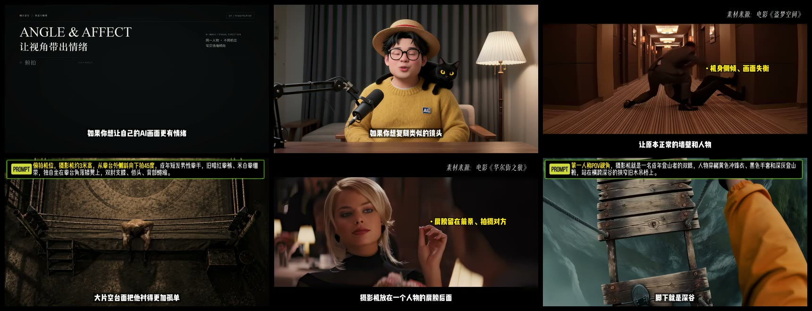
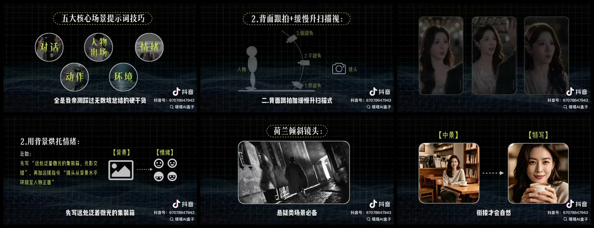
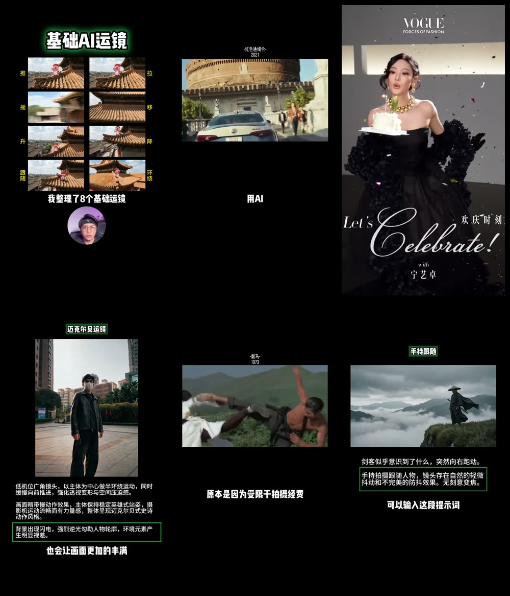

# AI 镜头角度教学：先看别人怎么做

## 1. 先说结论

这类内容**已经有人做，而且主流形态确实是视频**。

原因不是“视频天然比图文高级”，而是镜头角度、景别、运镜都包含变化过程。优秀案例通常同时让观众看到：

1. 原片或 AI 成片效果；
2. 摄影机位置示意；
3. 对应提示词；
4. 改变角度后的 A/B 结果。

只有概念文字，没有同屏画面对比，观众很难建立直觉。当前《景别和镜头角度》v02 的问题不是资料不够，而是**案例画面没有跟在案例正文下面，且没有真实动态 A/B**。

### 推荐形式

首发做一条 **50–70 秒竖屏视频**，只讲：

> 同一个人物，平视、俯拍、仰拍，为什么像换了三个人？

再把视频里的三组关键帧和提示词裁成 6–7 页图文，作为第二次发布。一次练习，产出视频与图文两条内容，不增加新的生成任务。

## 2. 用户提供的三个参考样本

> 以下截图仅用于内部竞品研究，来自用户提供的本地参考视频，不是本账号可直接转载的发布素材。

### 样本 A｜《学会这 6 种镜头角度，让 AI 视频更有电影感！》

时长约 `4:12`，横屏讲解。

它不是对着镜头念“俯拍代表弱小”，而是交替展示：

- 真人口播；
- 电影原片；
- 机位名称和情绪功能；
- AI 仿拍画面；
- 绿色提示词框；
- 生成工具界面或结果。

值得学的是“一种角度 = 一个原片效果 + 一个 AI 复现 + 一条提示词”。不适合照搬的是 4 分钟以上的完整课程长度。

### 样本 B｜镜头组合与 AI 提示词教学

时长约 `3:34`，横屏课程式讲解。

它把知识拆成“机位示意图—场景画面—提示词—错误示例”。例如：

- 背面跟拍 + 缓慢升扫；
- 过肩反打构图；
- 主观俯拍；
- 荷兰倾斜镜头；
- 中景切特写。

这里最值得学的不是黑色网格视觉，而是每个概念都有图，且画面上直接标出“镜头在哪、人物在哪、怎么动”。

### 样本 C｜《AI 视频拍摄手法及应用场景》

时长约 `5:09`，竖屏讲解。

它使用大量电影片段和 AI 画面讲推、拉、摇、移、升、降、跟随、环绕、低机位广角和手持跟随，并把可复制提示词直接叠在画面底部。

这个样本证明：即使内容是知识科普，观众真正消费的仍然是“先看到效果，再拿走方法”。

## 3. 抖音上已有的同类案例

### 案例 1｜李一帆：AI 长视频丝滑连贯的 3 个方法

- 形式：视频教程；
- 内容：景别角度切换、动作中衔接、分镜组接剧情；
- 公开互动快照：约 `1.2 万赞 / 457 评论 / 1.0 万收藏 / 2206 分享`；
- 发布时间：2026-06-21；
- 链接：[抖音作品](https://www.douyin.com/video/7653852870844464113)。

收藏几乎追平点赞，说明观众把它当作“以后制作时要回来查”的工具型教程。这个信号比单纯点赞更适合我们的教学账号定位。

### 案例 2｜图图老丝讲 AI：15 秒之后怎么衔接

- 形式：视频教程；
- 核心方法：不要一直硬续同一个小全景，下一个镜头换景别或换过肩反打；
- 公开互动快照：约 `6316 赞 / 150 评论 / 6119 收藏 / 1200 分享`；
- 发布时间：2026-06-19；
- 链接：[抖音作品](https://www.douyin.com/video/7653051946925112250)。

这个案例的价值在于：它不讲完整电影理论，只解决一个制作痛点，因此标题、画面和方法能迅速对上。

### 案例 3｜Nano Banana Pro：单图生成无限镜头角度

- 形式：视频教程；
- 内容：基础角色、镜头角度、力量感与脆弱感、九角度故事板；
- 公开互动快照：约 `437 赞 / 317 评论 / 431 收藏 / 79 分享`；
- 发布时间：2026-01-12；
- 链接：[抖音作品](https://www.douyin.com/video/7594485676133928244)。

评论数和收藏数相对点赞很高，公开评论里多次出现“求提示词”。说明观众需要的不只是概念，而是能直接复制的生成配方。

### 案例 4｜Xuan 酱：15 种镜头角度控制技巧

- 形式：`5:35` 视频教程；
- 内容：低机位、平视、俯视等 15 种角度，对应人物出场、对话、情绪、动作和环境展示；
- 发布时间：2026-04-17；
- 链接：[抖音精选](https://jingxuan.douyin.com/m/video/7629619234309524751)。

它证明“大而全”的课程形式已经有人做。我们的差异化不应该是再做一个“15 种镜头大全”，而是把一个小概念拍得更短、更可复现。

## 4. 这些案例共同使用的内容结构

| 环节 | 画面承担的任务 | 旁白或字幕承担的任务 |
| --- | --- | --- |
| 3 秒钩子 | 同一主体三种角度快速对比 | “人物没变，为什么压迫感完全不同？” |
| 概念 | 机位示意与成片同屏 | 只说“机位高低改变观看关系” |
| 案例 | 播放 2–4 秒原片或 AI 小样 | 点出它为什么有效 |
| 提示词 | 高亮景别、角度、动作、运镜 | 解释每个字段控制什么 |
| A/B | 错误版与改写版连续播放 | 明确告诉观众改了哪一个变量 |
| 结尾 | 一张可截图保存的速查卡 | 给最小练习或下一期预告 |

真正有效的是“画面先证明，文字再命名”。不是先讲三段理论，再让观众自行想象效果。

## 5. 对本账号的具体建议

### 主方案：先发视频

题目收窄为：

> 同一个 AI 角色，平视、俯拍、仰拍到底差在哪？

建议只生成 `3 个 3–4 秒小样`：

1. 平视近景：普通、客观；
2. 俯拍近景：被动、暴露；
3. 仰拍中近景：强势、压迫。

全部使用同一角色、同一服装、同一停车场。每条只改变角度和必要的动作，不做复杂剧情。预计成片 50–70 秒，AI 视频素材总量只有 9–12 秒。

### 视频脚本骨架

| 时间 | 画面 | 文案 |
| --- | --- | --- |
| 0–3s | 三个角度连续闪切 | 同一个人，为什么看起来像换了三种性格？ |
| 3–12s | 平视 / 俯拍 / 仰拍定格对比 | 景别决定拍多近，角度决定你从哪里看她。 |
| 12–26s | 俯拍小样 + 提示词高亮 | 想让人物显得被空间压住：近景，高机位俯拍。 |
| 26–40s | 仰拍小样 + 提示词高亮 | 想让人物重新掌握主动：中近景，低机位轻微仰拍。 |
| 40–53s | “电影感”空词与可执行提示词 A/B | 别只写电影感，要写景别、角度、动作和运镜。 |
| 53–62s | 三镜头与速查卡 | 收藏这张表，下次写分镜直接套。 |

### 次方案：再切成图文

图文不是把视频旁白抄成八页，而是：

1. 封面：同一人物三角度拼图；
2. 平视：整页画面 + 一句用途 + 一条提示词；
3. 俯拍：整页画面 + 一句用途 + 一条提示词；
4. 仰拍：整页画面 + 一句用途 + 一条提示词；
5. 三者 A/B 对照；
6. 错误提示词与改写提示词；
7. 可截图保存的速查卡。

每页至少 `60%` 面积给画面，正文控制在 `40–70` 字。电影案例可以留在长文资料里，不应占据发布轮播的核心页面。

## 6. 当前稿件应该怎么改

1. 《沉默的羔羊》《终结者》从第 3、4 页主案例降到文末“延伸理解”；没有授权画面时不让它们承担核心教学。
2. 发布正文只保留停车场同一角色的三角度 A/B。
3. 每个角度必须配生成结果或至少配对应首帧，提示词紧贴图片出现。
4. 没有实际生成结果前，不发布“模型能稳定实现”的结论。
5. v02 保留为资料底稿；下一版应改成“视频脚本 + 图文复用稿”，不继续在原有八页文字上打补丁。

## 7. 证据边界

- 本地三个样本只用于观察内容结构，截图不得直接作为本账号发布素材。
- 抖音数据是 2026-09-20 的公开页面快照，不代表平台全量排名。
- 小红书 CLI 已验证登录状态，但搜索接口返回当前账号无访问权限，因此没有补猜小红书互动数据；用户提供的小红书视频仅按本地文件分析。
- “优先视频、再切图文”是基于样本形态、互动结构和当前账号每周精力做出的编辑判断。

