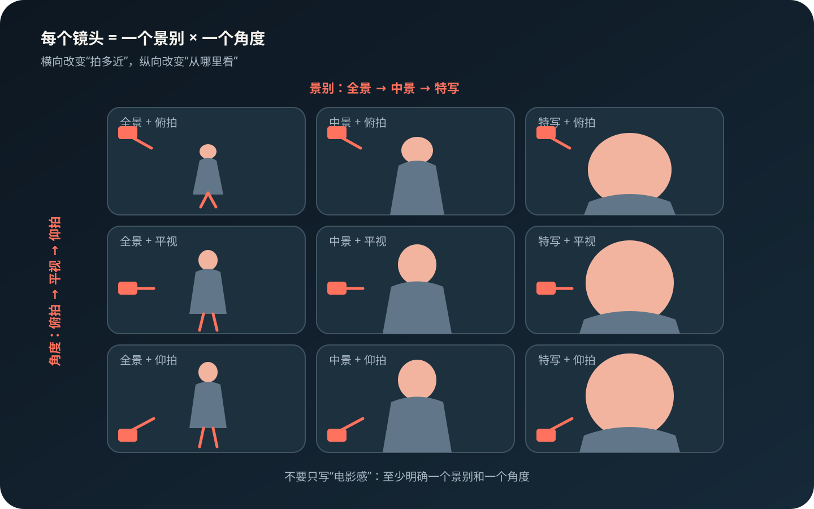

# AI 短剧导演基本功 01：景别和镜头角度，不是一回事

## 1. 本期编辑结论

这一期只解决一个问题：**景别决定“观众感觉离主体多近”，镜头角度决定“观众从哪里看主体”。**

两者不是互斥选项，而是每个镜头都可以同时拥有的两个维度。例如：

- `特写 + 平视`
- `中近景 + 低角度仰拍`
- `全景 + 高角度俯拍`

> 图 1｜原创示意。横向改变景别，纵向改变镜头角度；九个格子不是九种固定模板，而是两个维度的组合。

本期不扩展讲构图、焦段、运镜、灯光和角色一致性。它们会进入后续独立选题，避免一篇塞满、后面只能重复。

### 为什么值得先讲

1. Adobe Stock 的实际视频检索把 `Shot Size` 和 `Shot Angle` 分成两组筛选，说明它们在生产工具里本来就是不同字段。
2. AI 视频教程和分镜表通常也把景别、镜头角度、构图、运镜分开填写；混写容易得到含糊的“正面平拍”。
3. Runway 官方 AI 视频案例提供了“提示词—生成结果”对照，可以直接看到景别、机位和运镜词怎样进入生成提示词。
4. 本文另给出一组停车场三镜头复现方案，既有画面，也有文生视频和图生视频两版提示词。

## 2. 与已发布内容的去重边界

已发布的《AI短片开做前，角色和场景怎么准备？》已经覆盖：

- 一张近景看脸、一张全身图看造型；
- 先做场景底图，再把演员放进去；
- 参考图准备充分后，提示词可以更直接；
- `1 个角色 + 1 个场景 + 3 个连续镜头`的低成本练习。

本期不得再次展开“人物参考图怎么做”“场景母版怎么做”“参考图越完整提示词越短”等内容。旧文只作为系列起点，不复述正文。

已发布内容：[AI短片开做前，角色和场景怎么准备？](https://www.douyin.com/note/7686792126117791217)

## 3. 概念底稿

### 3.1 景别：画面收进多少信息

景别主要描述主体在画面中占多大，以及环境被保留多少。

| 景别 | 画面重点 | 常见叙事任务 |
| --- | --- | --- |
| 远景 / 大远景 | 环境远大于人物 | 交代世界、规模、孤独感 |
| 全景 | 人物全身与行动空间 | 看清走位、动作和人物关系 |
| 中景 | 腰部或膝部以上 | 对话、动作与环境兼顾 |
| 近景 | 胸部或肩部以上 | 观察反应和情绪变化 |
| 特写 / 大特写 | 面部或局部细节 | 强调眼神、道具、决定性信息 |

一句话记忆：**景别回答“我现在主要该看环境、动作、关系，还是情绪细节？”**

### 3.2 镜头角度：观众站在什么位置看

镜头角度主要描述摄影机相对主体的高度、方向或倾斜关系。

| 角度 | 空间关系 | 常见感受 |
| --- | --- | --- |
| 平视 | 与人物视线接近 | 日常、客观、平等 |
| 高角度俯拍 | 摄影机高于主体 | 弱小、暴露、受困，也可用于交代空间 |
| 低角度仰拍 | 摄影机低于主体 | 强势、压迫、英雄感或威胁感 |
| 顶视 / 鸟瞰 | 接近垂直向下 | 全局、秩序、疏离、图案感 |
| 荷兰角 | 地平线倾斜 | 失衡、不安、异常 |

一句话记忆：**角度回答“观众与这个人物处于平等、仰望、俯视，还是失衡的关系？”**

### 3.3 容易混淆但本期不展开的项目

- `广角镜头`可能指焦段或视野，不等于`全景`。
- `推镜、拉镜、环绕`属于运镜，不属于景别或角度。
- `居中、三分法、框中框`属于构图。
- `主光、轮廓光、顶光`属于灯光设计。

## 4. 外部实际案例

### 案例 A：Adobe Stock 把二者做成两组筛选

Adobe 的视频素材检索说明中，`Shot Size` 包含 Extreme Close Up、Close Up、Medium Shot、Long Shot 等；`Shot Angle` 则包含 Top Down、Aerial、High Angle、Eye Level、Low Angle 等。

这不是纯理论分类，而是用户在检索真实视频素材时必须分别选择的两个维度。

**转成图文里的表达：**

> 一个镜头可以既是“特写”，又是“低角度”。前者说拍多近，后者说从哪里拍。

来源：[Adobe《Visual Storytelling Shortcuts》，第 11 页](https://www.adobe.com/content/dam/cc/us/en/cct/autumn-winter-guide/pdf/FY22Q3_CC_Stock_Stock_UK_EN_AutumnWinterInsightsGuide.pdf)

### 案例 B：《沉默的羔羊》——先用景别缩短心理距离

Criterion 的影片文章指出，Jonathan Demme 拍 Clarice 与 Lecter 的对话时使用极近景正反打，并让演员直接看向镜头。极近景迫使观众持续观察 Clarice 的紧张与克制；直接凝视又让对话产生面对观众的压迫感。

这个案例适合用来说明：

- `极近景`首先是景别选择，它减少环境信息，把注意力压到面部；
- 直视镜头和正反打是另一个设计层，不应被笼统写成“拍个特写”；
- 景别负责“靠多近”，视线和角度继续决定“这份靠近是什么关系”。

来源：[Criterion：The Silence of the Lambs](https://www.criterion.com/current/posts/5-the-silence-of-the-lambs)

### 案例 C：《终结者》——不是拍得更近，而是把机位放到地面

摄影指导 Adam Greenberg 在 American Society of Cinematographers 的访谈中解释，团队专门做了低机位装置，让镜头贴近地面拍 Arnold Schwarzenegger。演员本来就高大，反复使用极低角度后，角色更像难以阻挡的怪物。

这个案例适合用来说明：

- 角色是否显得强大，不只取决于把人物放大；
- 即使主体占画面比例相近，只要机位从平视降到贴地仰拍，力量关系就会变化；
- 角度应服务角色功能，而不是为了“电影感”随便仰拍。

来源：[American Cinematographer：Adam Greenberg on The Terminator](https://theasc.com/article/the-terminator/)

### 案例 D：AI 漫剧实操——同一反派，用不同角度比较压迫感

一份公开 AI 动漫制作教程在反派登场镜头中，先确定人物、仓库场景和动作，再用低视角仰拍强化反派气势，并展示平视、偏仰视与俯视版本的差别。这里人物和剧情任务基本不变，主要变量是角度。

它证明了两点：

1. AI 提示词里“低角度仰拍”是可执行的摄影机信息；
2. 角度应该放在人物、场景和景别之后组合，而不是用“霸气、电影感”替代。

来源：[抖音公开教程：即梦 AI 动漫分镜与镜头角度示例](https://www.douyin.com/shipin/7382030110255286299)

### 案例 E：剪辑实操——同角度、同景别连续使用，容易像误剪

一则“古法剪辑”案例指出，连续镜头如果保持相同角度和相同景别，动作变化又不够大，很容易产生不自然的跳切；可通过改变角度，或从中景换成全景、特写来建立足够明显的视觉差异。

它适合作为本期结尾的进阶提醒：**景别和角度不仅影响单帧情绪，也影响两个镜头能不能顺利剪在一起。**

来源：[抖音公开案例：AI时代，为什么还需要“古法剪辑”](https://www.douyin.com/video/7638524868920741135)

## 5. 六页图文成稿

### 第 1 页｜封面

**主标题：**

> AI 视频总像监控？  
> 你可能把景别和角度混在一起了

**角标：**

`AI 短剧导演基本功 01`

**小字：**

`一个决定拍多近，一个决定从哪里拍`

**画面建议：**

使用同一人物的两张现有截图：左侧平视中景，右侧低角度中近景。不要使用两个不同角色，否则观众会把差异误认为人物差异。

### 第 2 页｜先把两个词分开

**标题：**

> 景别和镜头角度，是两个不同的按钮

**正文：**

- 景别：观众感觉离主体多近？
- 角度：观众从哪里看主体？

Adobe Stock 检索真实视频时，也把 `Shot Size` 和 `Shot Angle` 分成两组筛选。

**底部结论：**

> “特写”不等于“俯拍”，“全景”也不等于“平视”。

**画面建议：**

自行绘制两个并排的简化下拉框，不直接复制 Adobe 界面截图：

- Shot Size：全景 / 中景 / 近景 / 特写
- Shot Angle：平视 / 俯拍 / 仰拍 / 顶视

### 第 3 页｜景别：决定你让观众看什么

**标题：**

> 《沉默的羔羊》为什么把脸拍得那么近？

**正文：**

Jonathan Demme 在 Clarice 与 Lecter 的对话中使用极近景正反打。环境几乎被拿掉，观众只能盯着呼吸、眼神和表情变化。

- 全景：先看人物在哪里
- 中景：看人物在做什么
- 近景：看人物如何反应
- 特写：看一个不能错过的细节

**底部结论：**

> 景别不是“高级感等级”，而是信息分配。

**画面建议：**

不直接转载电影剧照。使用自己的角色截图做四级裁切，并在旁边以文字注明《沉默的羔羊》的使用方式与来源。

### 第 4 页｜角度：决定人物和观众的关系

**标题：**

> 《终结者》没有变高，是摄影机趴下了

**正文：**

摄影团队把机位放到接近地面的位置，持续仰拍本就高大的 Terminator，让角色更像压过观众的怪物。

- 平视：我和他处在同一高度
- 俯拍：我从上方观察他
- 仰拍：他压在我和镜头上方

**底部结论：**

> 角度不是人物大小，而是观看关系。

**画面建议：**

使用一个自制火柴人或自己的反派角色，保持人物大小接近，只改变摄影机高度和朝向。

### 第 5 页｜放到 AI 提示词里

**标题：**

> 同一个反派，景别和角度要分开写

**不够可执行的写法：**

> 电影感，反派霸气登场，很有压迫感。

**更可执行的写法：**

> 中近景，低机位轻微仰拍。反派从仓库门口向镜头走近，上半身占画面约三分之二，肩膀挡住部分背景，身后的两名跟班后退半步。

**拆解：**

- 中近景：景别
- 低机位仰拍：角度
- 向镜头走近：主体运动
- 跟班后退：空间关系

**案例说明：**

公开 AI 漫剧教程也使用“同一反派、同一场景、改变平视/仰视/俯视”的方式比较结果。

### 第 6 页｜最小练习与互动

**标题：**

> 不用抽视频卡，先用一张人物图练会

**练习：**

从自己的成片里选一张人物中景，做三个版本：

1. 保持平视，只裁成特写；
2. 保持中景，改画摄影机为低角度仰拍；
3. 使用`中近景 + 低角度仰拍`组合。

比较三个版本分别改变了：

- 信息量；
- 人物与观众的关系；
- 是否适合接到前后镜头。

**互动文案：**

> 下一期讲“为什么连续两个同景别镜头，剪在一起会跳”。  
> 你最容易混淆的是景别、角度，还是运镜？

## 6. 发布标题与正文

### 推荐标题

**首选：**

> AI 视频总像监控？先分清景别和镜头角度

**备选：**

- 特写不是俯拍：AI 视频最容易混淆的两个词
- 一个决定拍多近，一个决定从哪里拍
- 为什么你写了“电影感”，AI 还是只会正面平拍？

### 发布正文草稿

很多 AI 分镜提示词会把景别、角度、构图和运镜混成一句。

其实最先要分清的是两件事：

- 景别决定观众感觉离人物多近；
- 镜头角度决定观众站在哪里看他。

《沉默的羔羊》用极近景把注意力压到人物的眼神和呼吸；《终结者》把摄影机放低，让角色在观众面前像一堵墙。

放到 AI 提示词里，不要只写“电影感、霸气、压迫感”，而要拆成：

`景别 + 镜头角度 + 主体动作 + 空间关系`

这期先把两个概念分开。下一期继续讲，为什么两个同景别镜头直接拼在一起，经常像剪坏了。

`#AI视频 #AI视频教程 #AI短剧 #镜头语言 #分镜 #AIGC`

## 7. 素材清单与成本

### 必需素材

1. 自有角色或成片截图 1 张；
2. 同一张图的全景、中景、近景、特写裁切版；
3. 同一角色的平视、俯拍、仰拍示意图；
4. 摄影机位置小图标、方向线和文字标签；
5. 第 5 页的错误提示词 / 正确提示词对比框。

### 外部案例使用边界

- 外部影片和创作者案例用于说明方法并标注来源；
- 当前版本不直接下载、截取或转载他人视频与电影剧照；
- 正式制图优先使用自己的《纯手工代码》《零界空间》或《限时婚约》现有画面复现关系；
- 若后续确需使用外部截图，先单独核对引用必要性、画面范围与平台版权风险。

### 成本估算

- 视频积分：0；
- 新生图：默认 0；
- 首次套版：约 60–90 分钟；
- 模板稳定后的同系列图文：约 30–60 分钟；
- 不需要为本期额外制作 A/B 视频。

## 8. 事实、来源与编辑判断

### 已核对事实

- Adobe 的公开资料把 Shot Size 和 Shot Angle 作为独立筛选项。
- Criterion 的文章明确描述《沉默的羔羊》对话段落使用极近景、正反打和直接凝视镜头。
- 《终结者》摄影指导说明团队使用贴地低机位强化 Arnold Schwarzenegger 的体量和怪物感。
- 抖音公开 AI 教程分别把景别、镜头角度、构图等信息写入分镜或提示词，并展示了仰拍反派的实际用法。

### 编辑判断

- 将以上案例压缩成六页，是针对当前账号低成本、连续科普定位做出的内容选择。
- “景别是距离、角度是位置”是便于入门的记忆法，不取代完整摄影理论。
- 预计搜索友好词为“AI视频镜头角度、AI视频景别、AI分镜、AI视频提示词”；这是编辑判断，不是平台关键词流量结论。

### 来源清单

1. [Adobe：Visual Storytelling Shortcuts](https://www.adobe.com/content/dam/cc/us/en/cct/autumn-winter-guide/pdf/FY22Q3_CC_Stock_Stock_UK_EN_AutumnWinterInsightsGuide.pdf)
2. [Adobe：Different types of shots and camera angles in film](https://www.adobe.com/au/creativecloud/video/production/cinematography/camera-shots-and-angles.html)
3. [Criterion：The Silence of the Lambs](https://www.criterion.com/current/posts/5-the-silence-of-the-lambs)
4. [American Cinematographer：Adam Greenberg on The Terminator](https://theasc.com/article/the-terminator/)
5. [抖音：AI 漫剧脚本与分镜制作教程](https://www.douyin.com/shipin/7298327058231478335)
6. [抖音：即梦 AI 动漫分镜与镜头角度示例](https://www.douyin.com/shipin/7382030110255286299)
7. [抖音：AI时代，为什么还需要“古法剪辑”](https://www.douyin.com/video/7638524868920741135)

资料快照日期：2026-09-20。抖音搜索与相关推荐受账号、时间和排序影响，只作为公开案例，不代表平台全量热度。

## 9. 后续不重复的递进顺序

1. 本期：景别与镜头角度；
2. 下一期：为什么连续两个同景别、同角度镜头容易跳切；
3. 再下一期：主体位置、前景和留白；
4. 再下一期：推、拉、环绕、跟拍分别解决什么叙事问题；
5. 再下一期：180 度轴线与双人过肩反打；
6. 再下一期：把动作、摄影机和光线组合成最小提示词。

每期只引用以前的结论，不重复解释以前的知识点。
